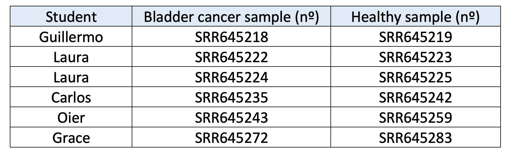

## **BACKGROUND** 
:) :) :)
Bladder cancer is one of the most common disorders worldwide, with more than 573,000 new cases in 2020 and transitional cell carcinoma (TCC) being the most common primary neoplasm of the urinary bladder. Moreover, it is a disease that is generally diagnosed early, when the cancer is highly treatable. However, even early-stage bladder cancers can return after successful treatments.

In this work, we have based on the scientific paper published by Guo G. et al. [@guo2013whole], where the researchers have performed a genomic analysis of TCC by both whole-genome and whole-exome sequencing in order to not only confirm existing mutations that are documented in the literature but also to identify additional genes and pathways that play a key role in this disease. For this, we have performed both a DNA-Seq and an RNA-Seq analysis to try to replicate some of the results obtained in the paper.


**FOTO**


## **1. PREPARACIÓN DE MUESTRAS**

Regardless of the distinction made in this project between DNA and RNA samples, the first step consisted of obtaining the *FastQCs* and *MultiQCs* for both cases. In order to obtain the FastQCs, a job array was created to speed up the process and, specifically, the code followed for each of the samples was as follows: 

```{r, eval=FALSE, echo=TRUE, message=FALSE, warning=FALSE}

#!/bin/bash

#SBATCH --job-name=Kallisto
#SBATCH --account=biomedicine
#SBATCH --partition=biomedicine
#SBATCH --cpus-per-task=8
#SBATCH --nodes=1
#SBATCH --mem=3G
#SBATCH --time=00:20:00
##SBATCH --mail-type=END
##SBATCH --mail-user=a905383@alumni.unav.es
#SBATCH -o /scratch/a905383/HPC_A/logs_Kallisto/kallisto%a.log
#SBATCH -o /scratch/a905383/HPC_A/fasta_files/logs/logs%a.log

export PATH="/scratch/a905383/FastQC:$PATH"

module load Java

file=($(ls /scratch/arubio/RNAseq/*.fastq.gz))
filename=${file[$SLURM_ARRAY_TASK_ID]}
echo $filename

fastqc $filename -o /scratch/arubio/RNAseq/FastqcReports

```

Once all the *FastQCs* were obtained, the efficiency of the process was analysed after having used the indicated resources and the results are shown in Figure 1. In particular, it can be seen that both the efficiency of the memory and the CPU was very low, indicating that the resources used were excessive. In other words, resources were wasted. Therefore, it can be concluded that the results would have been better if the amount of memory had been reduced and if fewer CPUs had been used. 


The next step was to generate a *MultiQC* for the DNA samples and another one for the *RNA* samples. To do this, the *multiqc* command was used and the corresponding files were generated directly from the command line. 

Then, after having carried out the first step for both types of samples, the analysis was separated in two, i.e. on one hand, an analysis was carried out with the *DNA* samples and, secondly, a study was carried out with the *RNA* samples. 


## **2. DNA**

   


### 2.1. Alignment

First of all, the BWA samples were obtained, and then the index had to be built. To build it the FASTA file of the reference genome was obtained from the Ensembl webpage (citar). To perform this task no Atlas job was performed, since the FASTA was directly downloaded by using the command line:

```{r, eval = FALSE, echo=TRUE, message=FALSE, warning=FALSE}
wget ftp://ftp.ensembl.org/pub/release-106/fasta/homo_sapiens/dna/Homo_sapiens.GRCh38.dna.primary_assembly.fa.gz
```

After downloading the FASTA file of the reference genome, we used it to make the index for all the .BAM genomic samples, which were stored in the resultsBWA directory. 

```{r, eval = FALSE, echo=TRUE, message=FALSE, warning=FALSE}
#!/bin/bash

#SBATCH --job-name=index_bai
#SBATCH --account=biomedicine
#SBATCH --partition=biomedicine
#SBATCH --cpus-per-task=1
#SBATCH --nodes=1
#SBATCH --mem=100G
#SBATCH --time=1:00:00

cd /scratch/arubio/bin
./ijob
cd /scratch/arubio/bin
. moduleloadNGS
cd /scratch/arubio/DNASeq/resultsBWA
for SAMPLE in /scratch/arubio/DNASeq/resultsBWA/*bam;
do
samtools index $SAMPLE
done
```
First, the ATLAS resources used were 1GB of memory and we set a 1-hour job. This failed, as the index needed more memory to be built. For this reason, the memory was increased to 100GB randomly. In the end, the job was completed but after analyzing the memory efficiency of the resources used (1 hour and 100GB) only 4.33GB were actually used. Therefore the Memory efficiency was only 4.33%. On the other hand, the CPU Efficiency was 99.06% which is really good and the CPU utilized was 52 minutes and 49 seconds, which is a value within our set period. In the future, to perform another BWA index it would be recommended to only use around 5GB of memory and again 1 hour of CPU time if the index is going to be built with the same number of samples, which is approx 25 samples (mirar cuantas fueron).


### 2.2. Mark Duplicates

After obtaining the first .bam files with their corresponding indexes, the duplicates were eliminated, i.e. each of the aligned files was analysed and the reads that were the same were eliminated. In this way, if in one of the samples there was a mutation that was repeated multiple times, it is checked if this mutation is relevant or if the fact that it is repeated multiple times is due to an error in the amplification. 

To carry out this step, a job array was generated again in order to speed up the process and the .sbs file generated to run the job array was as follows: 


```{r, eval = FALSE, echo=TRUE, message=FALSE, warning=FALSE}

#!/bin/bash

#SBATCH --job-name=Duplicates
#SBATCH --account=biomedicine
#SBATCH --partition=biomedicine
#SBATCH --cpus-per-task=4
#SBATCH -N 1 # On one node
#SBATCH --mem=16G
#SBATCH --time=0-23:0:0
##SBATCH --mail-type=END
##SBATCH --mail-user=a905162@alumni.unav.es
#SBATCH -o /scratch/a905162/ngs/logs/duplicates%a.log

source /scratch/arubio/bin/moduleloadNGS

FILES=($(cd /scratch/arubio/DNAseq/resultsBWA/ && ls *.bam))

filename=${FILES[$SLURM_ARRAY_TASK_ID]}

java -Djava.io.tmpdir=`pwd`/tmp -jar $PICARD MarkDuplicates -I /scratch/arubio/DNAseq/resultsBWA/$filename -O /scratch/arubio/DNAseq/resultsBWA/noduplicantesbam/$filename -M /scratch/arubio/DNAseq/resultsBWA/noduplicantesbam/$(basename $filename .bam)_metrics.txt

```


When executing the code, we initially tried to remove duplicates from a single sample to check the resources needed to run the job array. It should be noted that when removing the duplicates there were a lot of problems with Java because it was mentioned that there was no space left, but when we checked that there was enough space to perform this step, finally a temporary folder was created that allowed us to run the code and obtain the new .bam file having removed the duplicates.

After obtaining the result of a single sample, the efficiency of the process was analysed and it was seen that 11 GB had been used and that the efficiency of the CPU had been of 11.77%. Therefore, when sending the job-array, the file was modified to the characteristics described in the code, i.e. 4 CPUs and a memory of 16 GB. 

Once the job-array was executed, the efficiency was checked and, taking into account that the resources had been modified, it was theoretically thought that the results would be good. However, analysing Figure 3, it can be seen that both CPU and memory efficiency are very low, which means that resources were wasted.


### 2.3. vcf generation

Once the duplicates were removed, the next step was to generate the corresponding vcf's using the code described below. 

```{r, eval = FALSE, echo=TRUE, message=FALSE, warning=FALSE}

#!/bin/bash

#SBATCH --job-name=vcf
#SBATCH --account=biomedicine
#SBATCH --partition=biomedicine
#SBATCH --cpus-per-task=8
#SBATCH -N 1 # On one node
#SBATCH --mem=8G
#SBATCH --time=0-23:0:0
##SBATCH --mail-type=END
##SBATCH --mail-user=a905162@alumni.unav.es
#SBATCH -o /scratch/a905162/ngs/logs/vcf%a.log

source /scratch/arubio/bin/moduleloadNGS

FILES=($(cd /scratch/arubio/DNAseq/resultsBWA/noduplicantesbam/ && ls *.bam))

filename=${FILES[$SLURM_ARRAY_TASK_ID]}

gatk HaplotypeCaller --native-pair-hmm-threads 8 -I /scratch/arubio/DNAseq/resultsBWA/noduplicantesbam/$filename -R /scratch/arubio/DNAseq/Auxfiles/dummy.fa -O /scratch/arubio/DNAseq/vcf/$filename.vcf
```


In the same way as before, a job-array was programmed, but before executing it, the vcf of a single sample was generated to check that the code worked and that the resources used were adequate. The result was a CPU efficiency of 67.96% and 3.73% in terms of memory. Therefore, analysing the results, it was decided to modify the script to reduce as much as possible the waste of resources and the resources described in the code were established, i.e. 8 CPUs and 8 GB of memory.  

After many hours of job-array execution, the results were found to be correct and the efficiency of the process was studied in Figure 4. In the same way as before, high efficiency percentages were expected, however, in the case of memory, this was not the case, as it can be seen that the result was 22.13%. In any case, the CPU efficiency was 86%, which indicates that selecting 8 cores for each of the tasks was correct. 


### 2.4. vcf reports

Tras haber calculado el vcf...

```{r, eval = FALSE, echo=TRUE, message=FALSE, warning=FALSE}

#!/bin/bash

#SBATCH --job-name=vcf1_report
#SBATCH --account=biomedicine
#SBATCH --partition=biomedicine
#SBATCH --cpus-per-task=2
#SBATCH -N 1 # On one node
#SBATCH --mem=1G
#SBATCH --time=0-23:0:0
##SBATCH --mail-type=END
##SBATCH --mail-user=a905162@alumni.unav.es
#SBATCH -o /scratch/a905162/ngs/logs/report1_%a.log

source /scratch/arubio/bin/moduleloadNGS

FILES=($(cd /scratch/arubio/DNAseq/resultsBWA/noduplicantesbam/ && ls *.bam))

filename=${FILES[$SLURM_ARRAY_TASK_ID]}

gatk BaseRecalibrator -R /scratch/arubio/DNAseq/Auxfiles/dummy.fa -I /scratch/arubio/DNAseq/resultsBWA/noduplicantesbam/$filename --known-sites /scratch/arubio/DNAseq/vcf/$filename.vcf -O /scratch/arubio/DNAseq/vcf/reports1/$(basename $filename )_report_1.table

```


Following the same procedure as before, the code was initially tested with a single sample in order to check that the result was correct and that the resources were consistent. However, when testing the CPU and memory efficiencies were of 12.44% and 1.78% respectively, so the resources had to be modified and it was decided that 2 CPUs per task and 1 GB of memory were sufficient. 

After having checked that the code worked and that the output was correct, the job-array was run to obtain the reports of all the samples and finally the efficiency of the process was checked and this is shown in Figure 5. In particular, it was observed that the efficiencies were lower than expected, so it would have been more optimal to reduce the resources. 


### 2.5. Recalibration and Processing after recalibration

Once the first vcfs and their reports were obtained, the .bam files were recalibrated, i.e. the quality of the files was modified. In particular, this has been necessary because....

For this purpose, the following code has been generated. 

```{r, eval = FALSE, echo=TRUE, message=FALSE, warning=FALSE}

#!/bin/bash

#SBATCH --job-name=recalibration
#SBATCH --account=biomedicine
#SBATCH --partition=biomedicine
#SBATCH --cpus-per-task=2
#SBATCH -N 1
#SBATCH --mem=1G
#SBATCH --time=0-23:0:0
#SBATCH --mail-type=END
#SBATCH --mail-user=a905162@alumni.unav.es
#SBATCH -o /scratch/a905162/ngs/logs/rec_%a.log

source /scratch/arubio/bin/moduleloadNGS

FILES=($(cd /scratch/arubio/DNAseq/resultsBWA/noduplicantesbam/ && ls *_aligned.bam))

filename=${FILES[$SLURM_ARRAY_TASK_ID]}

gatk ApplyBQSR -I /scratch/arubio/DNAseq/resultsBWA/noduplicantesbam/$filename --bqsr /scratch/arubio/DNAseq/vcf/reports1/$filename"_report_1.table" -O /scratch/a905162/ngs/recalibration2/$filename"_recalibrated.bam"

```


Initially, we started by recalibrating a single sample, but multiple errors occurred, which prevented us from reaching the final result. However, analysing the errors, it was observed that the problem was the lack of space in the scratch, so it was thought that by moving the files to our personal scratch the problem would be solved. However, when this was done, it was found that the space was common to the whole group, so moving the files to our personal folders didn't do anything. With this in mind, the next step was to move already used files to the personal dipc folder to free up space in the scratch in order to be able to generate the recalibrated files. As a result of this action, a single sample was run and in Figure 6 it can be seen that a result was obtained although the efficiencies were not as desired. 


Due to the fact that it was possible to recalibrate a single sample, it was thought that a job-array could be sent with the rest of the samples, but the lack of space prevented a final result in all the attempts made. Therefore, we started to obtain the files manually and one by one, but taking into account that this process was not efficient and that we reached a situation in which there was no space left on the disk, we decided to stop the process here and went directly to the next section. 


### 2.6. Ensemble and Maftools

This process was performed with the help of "Ensenmbl.org" website. As this process was not possible to be parallelize, each student uploaded two samples of normal .vcf files in order to be annotated. As this website is free of charge, the speed was not outstanding and took around five hours of runtime for each sample to be annotated.
The distribution of samples can be seen on the image beneath.



vcf --> tamaño menos a 50 MB --> muestras tumorales --> ensemble --> Archivo anotado --> sin CR --> vcf2maf --> maf --> gzip --> archivos juntos en un maf --> descargar los archivos individuales 

```{r, eval = FALSE, echo=TRUE, message=FALSE, warning=FALSE}

#!/bin/bash

#SBATCH --job-name=vcf2maf
#SBATCH --account=biomedicine
#SBATCH --partition=biomedicine
#SBATCH --cpus-per-task=1
#SBATCH -N 1
#SBATCH --mem=2G
#SBATCH --time=0-23:0:0
#SBATCH --mail-type=END
#SBATCH --mail-user=a905162@alumni.unav.es
#SBATCH -o /scratch/a905162/ngs/logs/vcf2maf_3_%a.log

source /scratch/arubio/bin/moduleloadNGS

files=($(cd /scratch/arubio/DNAseq/vcf/ && ls *_sinCR.vcf))
filename=${files[3]}

perl /scratch/arubio/bin/mskcc-vcf2maf-754d68a/vcf2maf.pl --input-vcf /scratch/arubio/DNAseq/vcf/$filename --output-maf /scratch/arubio/DNAseq/vcf/$(basename $filename _anotated_sinCR.vcf).maf --inhibit-vep --ref-fasta //scratch/arubio/.vep/homo_sapiens/102_GRCh38/Homo_sapiens.GRCh38.dna.toplevel.fa.gz --ncbi-build GRCh38 --tumor-id SRR645235 --normal-id SRR645236

```


## **3. RNA**

### 3.1. Kallisto

In this step all FASTQC files from patients in the study were alligned against the reference human transcriptome. The objective here is to obtain a .bam file from each alligment.Here the code used for kallisto alligment is shown: 

```{r, eval = FALSE, echo=TRUE, message=FALSE, warning=FALSE}

#!/bin/bash

#SBATCH --job-name=Kallisto
#SBATCH --account=biomedicine
#SBATCH --partition=biomedicine
#SBATCH --cpus-per-task=1
#SBATCH -N 1 # On one node
#SBATCH --mem=4G
#SBATCH --time=0-23:0:0
##SBATCH --mail-type=END
##SBATCH --mail-user=a905162@alumni.unav.es
#SBATCH -o /scratch/a905162/ngs/logs/kallisto%a.log

source /scratch/arubio/bin/moduleloadNGS

FILES=($(cd /scratch/arubio/RNAseq/ && basename --suffix=_1.fastq.gz -- *_1.fastq.gz))

filename=${FILES[$SLURM_ARRAY_TASK_ID]}
mkdir /scratch/a905162/ngs/KallistoMaps/${filename}

chmod 770 /scratch/a905162/ngs/KallistoMaps/${filename}

kallisto quant -i /scratch/arubio/GenomicFiles/kallisto_Assignment_index.idx -o /scratch/a905162/ngs/KallistoMaps/$filename -b 25 -t $SLURM_CPUS_PER_TASK -g /
```

This code was run in ATLAS PC in order to paralelize the job, at first 1 node and 16G of RAM were used but the job efficiency was 23.12%. In order to have a better usage of ATLAS resources, the job was sent again but only using 4G of RAM memory. Finally the efficiency reached has been represented in Figure 11.  


### 3.2. Procesamiento de datos RNA-Seq

To process the RNA-Seq data, to begin with, the required libraries had to be loaded.

```{r, eval=FALSE, echo=TRUE, message = FALSE, warning=FALSE}
library(readr)
library(sleuth)
library(biomaRt)
library(clusterProfiler)
library(org.Hs.eg.db)
library(ggplot2)
library(gplots)
library(ggrepel)
library(EnsDb.Hsapiens.v79)
```

The sample data was downloaded from ADI, and it was also necessary to change the names of the columns in order to correctly identify each of the variables. Furthermore, it was also important to split the column called *sample_name* into two different variables: *sample_ID* (IDs of the subjects) and *sample_type* (Normal or Cancer). 

```{r, eval=FALSE, echo=TRUE, message = FALSE, warning=FALSE}
samples <- read_csv("samples_finalwork.csv",col_names = FALSE)

# View(samples)

colnames(samples) <- c("ID", "library_strategy", "base_pair_fragment", "Bioproject", "Biosample", "Accession", "X7", "library_selection", "library_source", "library_name", "end_date", "X12", "X13", "Run", "SRS", "SRA_study", "sample_name", "read_length", "center_name", "data_type", "sra", "ncbi", "library_instrument", "library_layout", "organism", "seq_type", "Published")

samples$sample_ID <- sapply(strsplit(samples$sample_name, "\\.|_"), function(X) X[1]) #selecciona la primera parte de antes de la "_"
samples$sample_type <- sapply(strsplit(samples$sample_name, "\\.|_"), function(X) X[2]) # selecciona la segunda parte de antes de la "_"
```


Finally, in order to relate the different transcripts with their corresponding genes, the following chunk of code shows the information that has been downloaded from *Ensembl* (citar), where we have the gene ID, the transcript ID, the chromosome name, and both the start and end of the transcript. However, we will only use the first two variables.

```{r, eval=FALSE, echo=TRUE, message = FALSE, warning=FALSE}
# Annotation
# Get all the transcripts, genes, go_id and domains

mart <- biomaRt::useMart(host = 'may2021.archive.ensembl.org',
                         biomart = "ensembl",
                         dataset =   "hsapiens_gene_ensembl") # hsapiens for human
Atributos <- listAttributes(mart)

GeneTransciptLocation <- getBM(attributes=c("ensembl_gene_id","ensembl_transcript_id","chromosome_name","transcript_start","transcript_end"),mart=mart)
```


### 3.3. Load and process the data generated with Kallisto

Once having obtained the output from Kallisto, we have merged that information into a matrix containing the TPM values of each transcript per sample.

```{r, eval=FALSE, echo=TRUE, message=FALSE, warning=FALSE}
base_dir <- "/home/osboxes/Desktop/NGSFolder/FinalWork_NGS_HPC/FinalWork_NGS_HPC/samples" #base_dir = directory where the output of kallisto is stored
sample_id <- dir(base_dir) #sample_id = the names of the folders.

dirsample<-(paste0(base_dir,"/",sample_id[1]))
dirtoload <- paste0(dirsample,"/","abundance.tsv")
RNASeq <- read.delim(dirtoload,sep = "\t", colClasses = c(NA,"NULL","NULL","NULL",NA))
for (n in 2:length(sample_id)){
  dirsample<-(paste0(base_dir,"/",sample_id[n]))
  dirtoload <- paste0(dirsample,"/","abundance.tsv")
  RNASeq[,n+1] <- read.delim(dirtoload,sep = '\t', colClasses = c('NULL','NULL','NULL','NULL',NA))
}

rownames(RNASeq) <- sapply(strsplit(as.character(RNASeq[,1]),"\\|"),function(X) return(X[1]))
RNASeq<-RNASeq[,-1]
RNASeq2<-as.matrix(RNASeq)
colnames(RNASeq2)<-sample_id
```


### 3.4. Design and contrast matrices

Next, we will explain both the design and contrast matrices that has been built. The variable that will be studied is the sample type, that is, the difference in gene expression between normal and malignant samples. We will take as reference the normal samples. 

```{r, eval=FALSE, echo=TRUE, message = FALSE, warning=FALSE}
# we build the design matrix

model_matrix <- model.matrix(~ sample_ID + sample_type, data = samples)
```

As we will study the *sample type* variable, we just need to build a contrast matrix for this one. Additionally, we need to define the betas and the null hypothesis. First of all, let’s establish the other variables in the design matrix. From the second column to the sixteenth one represent the different patients, since the study is paired. The last column refers to the variable that we want to study, that is, the sample type. Now, we can define the null hypothesis and build the contrast matrix.

We define $\beta_0$ as the mean expression of the transcripts in the normal sample of patient B18. Then, $\beta_0 + \beta_1$ is the mean expression of the normal sample of patient B23, and so on and so forth until $\beta_0 + \beta_{15}$, which is the mean isoform expression of the normal sample of patient B77. However, we are not interested in studying the differences in gene expression among different patients. In fact, as the contrast that we want to make is related to the difference between normal and malignant samples, the null hypothesis is that there is not a significant difference between those two, so $\beta_{16}}$ needs to be equal to 0.

```{r, eval=FALSE, echo=TRUE, message = FALSE, warning=FALSE}
# we create the contrast matrix

cont.matrix <- c(rep(0, ncol(model_matrix)-1), 1)
```


### 3.5. Sleuth

After having run kallisto for each of the samples, a differential expression analysis will be carried out using sleuth. Sleuth is an RNA-Seq analysis program for which kallisto has been used to quatify transcript abundances (cite). First of all, we need to create a tab delimited metadata file for the experiment so we have the factors for each sample ID (header "sample"), the ID of the patients (header "sample_ID"), the type of the sample, that is, whether the sample is normal or malignant (header "sample_type"), and the file path (header "path") to the kallisto output for each sample.

```{r, eval=FALSE, echo=TRUE, message = FALSE, warning=FALSE}
samples_red <- samples[which(samples$Run %in% sample_id),]
samples_red <- samples_red[match(sample_id, samples_red$Run),]

#With the next line we obtain the complete path
kal_dirs <- sapply(sample_id, function(id) file.path(base_dir,id))

#Build a data.frame with the sample ID, patient ID, condition (normal/cancer) and the kallisto directories for each sample. 
s2c <- data.frame(sample = sample_id,
                  sample_ID = samples_red$sample_ID,
                  sample_type = samples_red$sample_type)

#check that it is ordered
if (!identical(as.vector(s2c$sample),names(kal_dirs))){
  iix <- match(s2c$sample,names(kal_dirs))
  kal_dirs<-kal_dirs[iix]
}
s2c <- dplyr::select(s2c, sample = sample, sample_ID = sample_ID, sample_type = sample_type)
s2c <- dplyr::mutate(s2c, path = kal_dirs)

#Assign the condition value to the intercept
s2c$sample_type <- relevel(as.factor(s2c$sample_type), "Normal") 

s2c_ordered <- s2c[with(s2c, order(sample_type)),]
```

Then, we follow a series of steps in order to obtain the final table. For that, we first load the kallisto processed data into the object using the *sleuth_prep* function. Afterwards we estimate parameters for both the full and reduced sleuth model and we finally perform the differential analysis using the likelihood ratio test (LRT). However, as this method does not report the fold change, we also need to run the Wald test (WT), even though the former test is considered a better one. For most of the analyses and plots that will be carried out in this project the output corresponding to the LRT test will be used, employing the table generated with the WT test just to visualize the volcano plots.

```{r, eval = FALSE, echo=TRUE, message=FALSE, warning=FALSE}
# Load the kallisto processed data into the object
s1 <- sleuth_prep(s2c_ordered, extra_bootstrap_summary=T) 

# Estimate parameters for the sleuth response error measurement (full) model
so <- sleuth_fit(s1, ~ sample_ID + sample_type, fit_name =  'full')

# Estimate parameters for the sleuth reduced model
so <- sleuth_fit(so, ~ sample_ID, fit_name = 'reduced')

# Perform differential analysis (testing)
so <- sleuth_lrt(so,'reduced', 'full')

# Statistical Analysis result
sleuth_table_lrt <- sleuth_results(so, 'reduced:full', 'lrt', show_all = FALSE)
sleuth_significant_lrt <- dplyr::filter(sleuth_table_lrt, qval <= 0.001) #hemos bajado el qvalue de 0.05 a 0.001 porque con 0.05 habia 45000 trnascritos significativos, el valor de 0.001 lo hemos ido ajustando

# We also prform the WT analysis
so <- sleuth_wt(so, paste0('sample_typeCancer'))
sleuth_table_wt <- sleuth_results(so, paste0('sample_typeCancer'))
```

```{r, eval=FALSE, echo=FALSE, message=FALSE, warning=FALSE}
# load sleuth_table_lrt
# load sleuth_table_wt
sleuth_significant_lrt <- dplyr::filter(sleuth_table_lrt, qval <= 0.001)
```


### 3.6. Gene Ontology

The enrichGO function of the ClusterProfiler R package was used to perform the Gene Ontology (GO) enrichment analysis for biological processes [cite]. The genes related to the gene transcripts with FDR < 0.001 were selected. The gene universe consisted of the more than 60,000 genes that were identified in *Ensembl* [cite]. Moreover, in all the cases, we selected the GO terms with FDR < 0.05 and, among them, we used a cut-off value of 0.7 to reduce redundant GO terms, which means that out of the terms that have a similarity higher than 0.7 (redundant terms), only one of them will be selected (representative term). Based on the FDR value, the top 20 GO terms were selected as the most enriched processes.

```{r, eval=FALSE, echo=TRUE, message = FALSE, warning=FALSE}
sig_transcripts <- sapply(strsplit(sleuth_significant$target_id,"\\."),function(X) return(X[1]))

iij <- which(GeneTransciptLocation$ensembl_transcript_id %in% sig_transcripts)
sig_genes <- GeneTransciptLocation$ensembl_gene_id[iij]

universe <- unique(GeneTransciptLocation$ensembl_gene_id)
```

```{r, eval=FALSE, echo=TRUE, message = FALSE, warning=FALSE}
enrichGO <- clusterProfiler::enrichGO(gene = sig_genes, OrgDb = "org.Hs.eg.db",
                                          keyType ='ENSEMBL',  ont ='BP', pvalueCutoff = 0.01,
                                          pAdjustMethod = 'fdr', universe = universe,
                                          qvalueCutoff = 0.05, minGSSize = 5, maxGSSize = 600,
                                          readable ='FALSE', pool = 'FALSE')	

database_enrichgo <- data.frame(enrichGO)
```

```{r, eval=FALSE, echo=TRUE, message = FALSE, warning=FALSE}
# We use simplify to remove redundant GO terms

enrichGO@result <- enrichGO@result[which(enrichGO@result$p.adjust < 0.05),]

enrichGO_simplified <- simplify(enrichGO, cutoff=0.7, by="p.adjust", select_fun=min)

database_enrichGO_simplified <- data.frame(enrichGO_simplified)
```


```{r, eval=FALSE, echo=FALSE, message=FALSE, warning=FALSE}
# Dotplots

dotplot_enrichGO_simplified <- enrichplot::dotplot(enrichGO_simplified, showCategory = 20) + ggtitle("Dotplot")
dotplot_enrichGO_simplified


# Enrichment Maps

emapplot_enrichGO_simplified <- emapplot(enrichGO_simplified) + theme(plot.title = element_text(hjust = 0.5)) + ggtitle("Enrichment Map")
emapplot_enrichGO_simplified


# Other plots

cnetplot(enrichGO_simplified)
```

As our project is based on a scientific article that was published in 2013, we decided to compare some of the genes that were obtained in our analysis with the ones reported by the researchers. To do that, first of all, we had to change the ID of the genes in order to match the names with the ones that appear on the paper. We were most interested in the comparison between the genes related to the chromosome segregation function that appeared in the GO enrichment analysis (GO:0007059) with the genes that the paper mentioned are related to the same function (*STAG2* and *ESPL1*). As a result, we could see that both of them were included in our results, which is completely logical.

```{r, eval=FALSE, echo=TRUE, message=FALSE, warning=FALSE}
sig_genes_symbol_ens <- ensembldb::select(EnsDb.Hsapiens.v79, keys = sig_genes, keytype = "GENEID", columns = c("SYMBOL","GENEID"))
sig_genes_symbol <- sig_genes_symbol_ens[,1]

genes_paper_RNA <- c("STAG2","ESPL1","FGFR3","TACC3") #genes que aparecen en el abstract. STAG2 y ESPL1 están relacionados con la función de "sister chromatid cohesion and segregation"
genes_conocidos <- c("TP53", "HRAS", "FGFR3", "PIK3CA", "RB1", "KRAS", "TSC1") 
chrom_rem_genes <- c("UTX", "ARID1A", "MLL-MLL3", "CREBBP-EP300", "NCOR1", "CHD6")

database_enrichGO_simplified["GO:0007059","geneID"] #hay que eliminar las barras diagonales para tener un vector con los nombres de los genes

#PAra el variant calling debe haber mutaciones en los genes: UTX, MLL-MLL3, CREBBP-EP300, NCOR1,ARID1A, CHD6 (estos genes son los que se han descubierto)
#-Otros genes conocidos que estan mutados en bladder cancer: TP53, HRAS, FGFR3, PIK3CA, RB1, KARS, TSC1

which(genes_conocidos %in% sig_genes_symbol) #KRAS y HRAS
which(chrom_rem_genes %in% sig_genes_symbol) #NCOR1

## Hace falta comparar con la lista del choromosome segregation


database_enrichGO_simp_genes <- data.frame(database_enrichGO_simplified$geneID)
rownames(database_enrichGO_simp_genes) <- rownames(database_enrichGO_simplified)

genes_go_chrom_seg <- strsplit(database_enrichGO_simp_genes["GO:0007059",],"\\/")[[1]]

genes_go_chrom_seg_symbol_ens <- ensembldb::select(EnsDb.Hsapiens.v79, keys = genes_go_chrom_seg, keytype = "GENEID", columns = c("SYMBOL","GENEID"))
genes_go_chrom_seg_symbol <- genes_go_symbol_ens[,1]

table(genes_paper_RNA %in% genes_go_chrom_seg_symbol)
which(genes_paper_RNA %in% genes_go_chrom_seg_symbol) #STAG2, ESPL1 y TACC3
```


La parte de IGV

We were expecting to find also the FGFR3 gene, but we realized that the researchers from the scientific article analyzed the gene fusions, which is not related to the differential expression analysis that has been carried out. For this reason, another approach has been taken. 
We have used the following chunk of code to download the .bam and .bai files of the cancer sample number SRR645259 from subject B59. With these files, we have opened them in the IGV software. As we were expecting to find a gene fusion, we were expecting to find each of the mates from genes FGFR3 and TACC3.
However, as can be seen in the image below (insertar captura de IGV), it cannot be seen what had initially been expected. For this reason, it has been decided to process the raw data of the corresponding sample using a different method.

```{r, eval=FALSE, echo=TRUE, message = FALSE, warning=FALSE}
scp a905208@atlas-fdr.sw.ehu.es:/scratch/arubio/DNAseq/resultsBWA/noduplicatesbam/SRR645259_aligned.bam* E:/NGSFolder/FinalWork_NGS_HPC/FinalWork_NGS_HPC/IGV_sample
```


La parte de STAR

First of all, the following .sh file has been created in order to get the required index.

```{r, eval=FALSE, echo=TRUE, message = FALSE, warning=FALSE}
#!/bin/bash

#SBATCH --account=biomedicine
#SBATCH --partition=biomedicine
#SBATCH --cpus-per-task=1
#SBATCH --nodes=1
#SBATCH --mem=1G
#SBATCH --time=01:00:00

cd /scratch/arubio/bin

. moduleloadNGS


cd /scratch/a905208/FinalWork/STAR/index

STAR --runThreadN 20 --runMode genomeGenerate --genomeDir /scratch/a905208/FinalWork/STAR/index --genomeFastaFiles /scratch/a905208/FinalWork/Homo_sapiens.GRCh38.dna.primary_assembly.fa --sjdbGTFfile /scratch/a905208/FinalWork/Homo_sapiens.GRCh38.106.gtf --sjdbOverhang 89
```

For this, it has been necessary to download the *Homo_sapiens.GRCh38.106.gtf.gz* file from *Ensembl*, since the one that was already available (*gencode.v24.annotation.sorted.gtf*) was not compatible with the FASTA file.

```{r, eval=FALSE, echo=TRUE, message = FALSE, warning=FALSE}
wget ftp://ftp.ensembl.org/pub/release-106/gtf/homo_sapiens/Homo_sapiens.GRCh38.106.gtf.gz
```

Once finished, the following two files (S1_R1.fq and S1_R2.fq) has been created.

```{r, eval=FALSE, echo=TRUE, message = FALSE, warning=FALSE}
cat SRR645259_1.fastq | head -n 1000000 > S1_R1.fq
cat SRR645259_2.fastq | head -n 1000000 > S1_R2.fq
```

Then, the following chunk of code has been executed from the command line. 

```{r, eval=FALSE, echo=TRUE, message = FALSE, warning=FALSE}
STAR --runThreadN 3 --genomeDir /scratch/a905208/FinalWork/STAR/index --readFilesIn S1_R1.fq S1_R2.fq --outFileNamePrefix S1_test --outSAMtype BAM SortedByCoordinate --outSAMunmapped Within --outSAMattributes NH HI AS NM MD
```

Finally, to generate the .bai file from the .bam file that has been generated in the previous step, the following code has been run.

```{r, eval=FALSE, echo=TRUE, message = FALSE, warning=FALSE}
samtools index S1_testAligned.sortedByCoord.out.bam
```


### 3.7. PCA

To separate all the samples in clusters based on the results of differential gene expression analysis we first performed a PCA selecting the 8198 differentially expressed transcripts (FDR < 0.001). The correct separation between the sample groups confirms that the selected transcripts could be considered adequate to stratify the samples in the two groups. Moreover, the axes are ranked in order of importance, where differences along the first principal component axis (PC1) are more important than differences along with the second principal analysis (PC2).

```{r, eval=FALSE, echo=TRUE, message = FALSE, warning=FALSE}
rownames(RNASeq2) <- sapply(strsplit(rownames(RNASeq2), "\\."), function(X) X[1])

RNASeq2_filtered <- RNASeq2[sig_transcripts,]

col.order <- s2c_ordered$sample
RNASeq2_filt_ord <- RNASeq2_filtered[, col.order]

PCs <- prcomp(t(log2(1+RNASeq2_filt_ord)), center = T, retx = T)

data_PCA <- data.frame(samples = rownames(PCs$x),
                       ID = s2c_ordered$sample_ID,
                       type = s2c_ordered$sample_type,
                       PC1 = PCs$x[,1],
                       PC2 = PCs$x[,2])
```


```{r, eval=FALSE, echo=FALSE, message=FALSE, warning=FALSE}
Fig_PCA <- ggplot(data_PCA) + geom_point(aes(x=PC1, y=PC2, color = type, size = 4)) + geom_label_repel(aes(x=PC1, y=PC2, label=ID)) +
  xlab('PC1') + ylab ('PC2') +
  theme_classic() + theme(legend.title = element_blank())
Fig_PCA
```


### 3.8. Heatmap

In order to visualize more clearly the expression pattern of the most significant transcripts, a heatmap has been plotted. In addition to showing both the sample and transcript IDs in the columns and rows respectively, they have been distributed using a hierarchical clustering algorithm, so that the samples or transcripts that show a more similar behavior are closer to each other.

```{r, eval=FALSE, echo=FALSE, message=FALSE, warning=FALSE}
RNASeq2_filt_ord <- RNASeq2_filtered[, col.order]

num_cancer <- length(which(s2c_ordered$sample_type=="Cancer"))
num_normal <- length(which(s2c_ordered$sample_type=="Normal"))


heatmap_plot <- heatmap.2(x = log2(1+RNASeq2_filt_ord[1:50,]),
                       col="bluered",
                       trace="none",
                       ColSideColors = c(rep("orange", num_normal), rep("dark green", num_cancer)),
                       main="Normal vs Cancer",
                       margins = c(4,10)
)
legend(0.9,1.2, legend = c("Normal", "Cancer"),col = c("orange", "dark green"), lty= 1, lwd = 10, cex = 0.7)
```


### 3.9. Boxplot

Next, we represent the gene expression values measured in TPMs of the top significant transcripts. To select the 10 most significant transcripts, those with a lower FDR value were chosen.

```{r, eval = FALSE, echo=TRUE, message=FALSE, warning=FALSE}
sig_transcripts_sample <- data.frame(tran_name_1 = sapply(strsplit(sleuth_significant_lrt$target_id[1:10],"\\."),function(X) return(X[1])),
                              tran_name_2 = sapply(strsplit(sleuth_significant_lrt$target_id[1:10],"\\."),function(X) return(X[2])))

iij_sample <- which(GeneTransciptLocation$ensembl_transcript_id %in% sig_transcripts_sample$tran_name_1)
sig_genes_sample <- GeneTransciptLocation$ensembl_gene_id[iij_sample]

sig_trans_genes_sample <- GeneTransciptLocation[iij_sample, c(1,2)]
colnames(sig_transcripts_sample)[1] <- "ensembl_transcript_id"
sig_df <- merge(sig_transcripts_sample, sig_trans_genes_sample, by = c("ensembl_transcript_id"))

sig_genes_symbol_ens_sample <- ensembldb::select(EnsDb.Hsapiens.v79, keys = sig_genes_sample, keytype = "GENEID", columns = c("SYMBOL","GENEID"))
colnames(sig_genes_symbol_ens_sample)[2] <- colnames(sig_df)[3]
sig_df <- merge(sig_df, sig_genes_symbol_ens_sample, by = c("ensembl_gene_id"))
sig_df$SYMBOL_transcript_id <- paste0(sig_df$SYMBOL, "_", sig_df$tran_name_2)

RNASeq2_filt_ord_sample <- log2(1+RNASeq2_filt_ord[sig_transcripts_sample,])

sig_df_bp <- sig_df[match(sig_transcripts_sample, sig_df$ensembl_transcript_id),]

data_boxplot <- data.frame(transcripts = rep(sig_df_bp$SYMBOL_transcript_id, length(col.order)), sample_id = rep(col.order, each=length(sig_df_bp$SYMBOL_transcript_id)), sample_type = gl(2,length(sig_df_bp$SYMBOL_transcript_id)*num_normal,labels = c('Normal','Tumor')), values = as.vector(RNASeq2_filt_ord_sample))
data_boxplot$transcripts = as.factor(data_boxplot$transcripts)
```


```{r, eval=FALSE, echo=FALSE, message=FALSE, warning=FALSE}
Fig_boxplot <- ggplot(data = data_boxplot, aes(x = transcripts, y = values, fill = sample_type)) +
  geom_boxplot(width=0.5,position=position_dodge(width=0.5),outlier.shape = NA) +
  coord_cartesian(ylim =c(0,10))+ theme_classic() +
  stat_boxplot(geom="errorbar",position = position_dodge(width=0.5),width=0.2)+
  theme(plot.title = element_text(hjust = 0.5,margin=margin(0,0,10,0), size = 11),
        axis.text.x = element_text(hjust=0.9,vjust=0.9,angle=45),
        axis.text.y = element_text(margin=margin(0,0,0,10)),
        axis.title.x=element_blank(),
        axis.title.y = element_blank(),
        panel.grid.major = element_blank(),
        panel.grid.minor = element_blank(),
        panel.background = element_rect(colour = "black", size = 1),
        axis.ticks.x = element_blank(),
        legend.title = element_blank()) +
  ggtitle('Gene expression of the 10 most significant transcripts')
Fig_boxplot
```


### 3.10. Volcano plot

Differential expression analysis revealed that between the normal and malignant groups of patients, there are 879 transcripts altered with an FDR < 0.01 and a beta > |3|. Moreover, 141 of them belong to the overexpressed group (beta > 3) whereas 738 of the isoforms are underexpressed (beta < -3). The labelled transcripts are the ones whose expression was plotted through a boxplot in the previous image. 

```{r, eval = FALSE, echo=FALSE, message=FALSE, warning=FALSE}
transcripts <- sapply(strsplit(sleuth_table_wt$target_id,"\\."),function(X) return(X[1]))
p_adjust <- sleuth_table_wt$qval
beta <- sleuth_table_wt$b

volcano_df <- data.frame(transcripts = transcripts,
                         pvalue = -log10(p_adjust),
                         beta = beta)

volcano_df$sig <- factor(rep(0,nrow(volcano_df)), levels = c(-1,0,1))
volcano_df$sig[p_adjust < 0.01 & beta < -3] <- -1
volcano_df$sig[p_adjust < 0.01 & beta > 3] <- 1
volcano_df$lab <- ''

iix <- which(volcano_df$transcripts %in% sig_df$ensembl_transcript_id)
sig_df_ord <- sig_df[match(volcano_df$transcripts[iix], sig_df$ensembl_transcript_id),]

volcano_df$lab[iix] <- sig_df_ord$SYMBOL_transcript_id


Fig_volcano <- ggplot(data = volcano_df) + geom_point(aes(x = beta,
                                                          y = pvalue,
                                                          colour = sig),
                                                      size = 1) + 
  theme_classic() + scale_x_continuous(limits = c((-max(abs(beta)) - 0.5),
                                                  (max(abs(beta)) + 0.5))) +
  scale_color_manual(values = c("#2600D1FF","#000000","#D60C00FF"), drop = F) +
  theme(plot.title = element_text(hjust = 0.5),
        panel.grid.major = element_blank(), panel.grid.minor = element_blank(),
        panel.background = element_rect(colour = 'black', size = 1),
        legend.position = 'none') + ggtitle("Volcano  plot") + 
  xlab("Beta") + ylab(bquote(~-Log[10]~Adjusted~p-Value)) +
  geom_hline(yintercept = -log10(0.01), linetype = 'dashed') +
  geom_vline(xintercept = -3, linetype = 'dashed') +
  geom_vline(xintercept = 3, linetype = 'dashed') +
  geom_label_repel(aes(x = beta, y = pvalue, label = ifelse(lab != '', lab, '')))
Fig_volcano
```


## **4. CONCLUSIONS**   


## **5. BIBLIOGRAPHY**  


