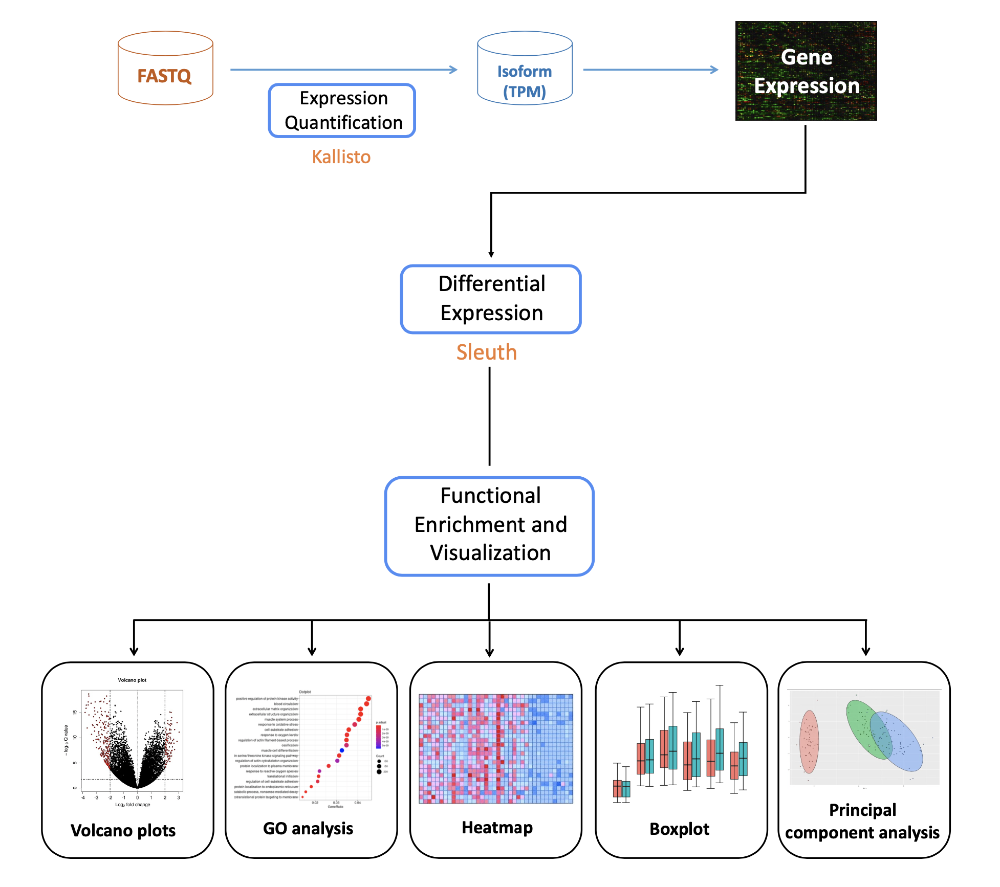

```{=html}
<style> body {text-align: justify} </style>
```
## **BACKGROUND**

Bladder cancer is one of the most common disorders worldwide, with more than 573,000 new cases in 2020 and transitional cell carcinoma (TCC) being the most common primary neoplasm of the urinary bladder. Moreover, it is a disease that is generally diagnosed early, when the cancer is highly treatable. However, even early-stage bladder cancers can return after successful treatments.

In this work, we have based on the scientific paper published by Guo G. et al. [@guo2013whole], where the researchers have performed a genomic analysis of TCC by both whole-genome and whole-exome sequencing in order to not only confirm existing mutations that are documented in the literature but also to identify additional genes and pathways that play a key role in this disease. For this, we have performed both a DNA-Seq and an RNA-Seq analysis to try to replicate some of the results obtained in the paper.

**FOTO**

## **1. SAMPLES PREPARATION**

Regardless of the distinction made in this project between DNA and RNA samples, the first step consisted of obtaining the *FastQCs* and *MultiQCs* for both cases. The FastQC file is used to represent the read information of the sequencing process. Each read is composed of 4 lines: name, sequence and sequence quality. It should be noted that in this case we worked with paired-end samples, so each of the samples had to result in two FastQC files. Taking into account that we started with 28 DNA samples, 28 RNA samples and that for each sample 2 FastQC files were generated, as a result we obtained a large number of files that would have been difficult to analyze individually. Therefore, in order to simplify the analysis, the next step was to merge all the files (separated by RNA and DNA) to create a single file for DNA and another one for RNA using the *multiqc* function.

### 1.1. FastQC

In order to obtain the FastQCs, a job array was created to speed up the process and, specifically, the code followed for each of the samples was as follows:

```{r, eval=FALSE, echo=TRUE, message=FALSE, warning=FALSE}

#!/bin/bash

#SBATCH --job-name=Kallisto
#SBATCH --account=biomedicine
#SBATCH --partition=biomedicine
#SBATCH --cpus-per-task=8
#SBATCH --nodes=1
#SBATCH --mem=3G
#SBATCH --time=00:20:00
##SBATCH --mail-type=END
##SBATCH --mail-user=a905383@alumni.unav.es
#SBATCH -o /scratch/a905383/HPC_A/logs_Kallisto/kallisto%a.log
#SBATCH -o /scratch/a905383/HPC_A/fasta_files/logs/logs%a.log

export PATH="/scratch/a905383/FastQC:$PATH"

module load Java

file=($(ls /scratch/arubio/RNAseq/*.fastq.gz))
filename=${file[$SLURM_ARRAY_TASK_ID]}
echo $filename

fastqc $filename -o /scratch/arubio/RNAseq/FastqcReports

```

Once all the *FastQCs* were obtained, the efficiency of the process was analysed after having used the indicated resources and the results are shown in Figure 1. In particular, it can be seen that both the efficiency of the memory and the CPU was very low, indicating that the resources used were excessive. In other words, resources were wasted. Therefore, it can be concluded that the results would have been better if the amount of memory had been reduced and if fewer CPUs had been used.

<center>

{width="511"}

</center>

### 1.2. MultiQC

The next step was to generate a *MultiQC* for the DNA samples and another one for the *RNA* samples. To do this, the *multiqc* command was used and the corresponding files were generated directly from the command line.

Then, after having carried out the first step for both types of samples, the analysis was separated in two, i.e. on one hand, an analysis was carried out with the *DNA* samples and, secondly, a study was carried out with the *RNA* samples.

[MultiQC report of DNA samples](multiqc_report_DNA.html)

Analysing the file generated for the DNA samples, it can be observed that in all samples there is a percentage of duplicates that has to be eliminated. On the other hand, analysing the GC content, it can be observed that it is almost the same in all samples, which is consistent, and this can be seen in the Per Sequence GC Content graph where each of the lines refers to a different sample. 

Furthermore, with regard to the number and the length of the reads, the vast majority have a length greater than 90 base pairs, and it should be noted that the number of reads in each of the samples is quite variable, ranging from 60.9 million to 90 million. 

Regarding the quality of the sequence, it can be observed that it decreases as the read length increases. That is, as the number of base pairs increases, the reliability of the results decreases, which is why multiple reads are used. 

[MultiQC report of RNA samples](multiqc_report_RNA.html)

Analysing the RNA samples, it can be seen at first glance that the percentage of duplicates is significantly higher and that the variability between samples is large. 

On the other hand, with regard to the GC content, it can be observed that the results are relatively similar and that the variability remains small. Furthermore, analysing the number of readings that each sample has, it can be observed that there is a great variability and also that the quantity is smaller.

Finally, with regard to the quality of the sequencing, it can be observed that the trend is maintained, since as the number of base pairs increases, the quality decreases. However, it should be noted that in this case the quality is lower, as although the trend is maintained, the quality is lower.


## **2. DNA**

<center>


</center>

### 2.1. Alignment

In order to perform the alignment, the first step was to download the FASTA file of the reference genome, i.e. the file in which the genomic information is described. Specifically, it was obtained from [Ensemble](https://www.ensembl.org/Homo_sapiens/Info/Index) and for this task no Atlas work was performed, since the FASTA was downloaded directly using the command line.

```{r, eval = FALSE, echo=TRUE, message=FALSE, warning=FALSE}

wget ftp://ftp.ensembl.org/pub/release-106/fasta/homo_sapiens/dna/Homo_sapiens.GRCh38.dna.primary_assembly.fa.gz

```

Once the FASTA file was obtained, the samples were aligned using the BWA men algorithm based on the Burrows-Wheeler transform. The code described below was used:

```{r, eval = FALSE, echo=TRUE, message=FALSE, warning=FALSE}

#SBATCH --job-name=bwa%a
#SBATCH --account=biomedicine
#SBATCH --partition=biomedicine
#SBATCH --cpus-per-task=10
#SBATCH --nodes=1
#SBATCH --mem=64G
#SBATCH --time=04:00:00
##SBATCH --mail-type=END
##SBATCH --mail-user=a905383@alumni.unav.es
#SBATCH -o /scratch/a905383/HPC_A/logs_BWA/bwa%a.log

source /scratch/arubio/bin/moduleloadNGS

file=($(cd /scratch/arubio/DNAseq/ && basename --suffix=_1.fastq.gz -- *_1.fastq.gz))
filename=${file[$SLURM_ARRAY_TASK_ID]}
SAMPLES_DIR=/scratch/arubio/DNAseq

echo $SAMPLES_DIR"/Auxfiles/Homo_sapiens.GRCh38.dna.primary_assembly.fa.gz"

nice bwa mem -M -t 10  -R "@RG\tID:ind1\tSM:ind1\tLB:ind1\tPU:ind1\tPL:Illumina" $SAMPLES_DIR"/Auxfiles/Homo_sapiens.GRCh38.dna.primary_assembly.fa.gz" $SAMPLES_DIR"/"$filename"_1.fastq.gz" $SAMPLES_DIR"/"$filename"_2.fastq.gz" samblaster -M | samtools fixmate - - | samtools sort -O bam -o $SAMPLES_DIR"/resultsBWA/"$filename"_aligned.bam"
```

It should be noted that as we worked with samples sequenced in paired-end mode, it was necessary to use the two FastQC files generated for each of the samples in the first section. As a result, a .bam file was obtained for each sample, i.e. a binary file was obtained containing the information from the FastQC file and the information of the mapping against the genome (chromosome, mapping position, CIGAR...). Once the .bam files were generated, the efficiency of the process was analysed in order to study whether the resources used had been correct and the results are shown in Figure 3:

<center>

{width="511"}

</center>

After generating the .bam files we maked the index for all the .BAM genomic samples, which were stored in the resultsBWA directory. First, the ATLAS resources used were 1GB of memory and we set a 1-hour job. This failed, as the index needed more memory to be built. For this reason, the memory was increased to 100GB randomly. In the end, the job was completed but after analyzing the memory efficiency of the resources used (1 hour and 100GB) only 4.33GB were actually used. Therefore the Memory efficiency was only 4.33%. On the other hand, the CPU Efficiency was 99.06% which is really good and the CPU utilized was 52 minutes and 49 seconds, which is a value within our set period. In the future, to perform another BWA index it would be recommended to only use around 5GB of memory and again 1 hour of CPU time if the index is going to be built with the same number of samples, which is approx 28 samples.

```{r, eval = FALSE, echo=TRUE, message=FALSE, warning=FALSE}

#!/bin/bash

#SBATCH --job-name=index_bai
#SBATCH --account=biomedicine
#SBATCH --partition=biomedicine
#SBATCH --cpus-per-task=1
#SBATCH --nodes=1
#SBATCH --mem=100G
#SBATCH --time=1:00:00

cd /scratch/arubio/bin
./ijob
cd /scratch/arubio/bin
. moduleloadNGS
cd /scratch/arubio/DNASeq/resultsBWA
for SAMPLE in /scratch/arubio/DNASeq/resultsBWA/*bam;
do
samtools index $SAMPLE
done
```

### 2.2. Mark Duplicates

After obtaining the first .bam files with their corresponding indexes, the duplicates were eliminated, i.e. each of the aligned files was analysed and the reads that were the same were eliminated. In this way, if in one of the samples there was a mutation that was repeated multiple times, it is checked if this mutation is relevant or if the fact that it is repeated multiple times is due to an error in the amplification.

To carry out this step, a job array was generated again in order to speed up the process and the .sbs file generated to run the job array was as follows:

```{r, eval = FALSE, echo=TRUE, message=FALSE, warning=FALSE}

#!/bin/bash

#SBATCH --job-name=Duplicates
#SBATCH --account=biomedicine
#SBATCH --partition=biomedicine
#SBATCH --cpus-per-task=4
#SBATCH -N 1 # On one node
#SBATCH --mem=16G
#SBATCH --time=0-23:0:0
##SBATCH --mail-type=END
##SBATCH --mail-user=a905162@alumni.unav.es
#SBATCH -o /scratch/a905162/ngs/logs/duplicates%a.log

source /scratch/arubio/bin/moduleloadNGS

FILES=($(cd /scratch/arubio/DNAseq/resultsBWA/ && ls *.bam))

filename=${FILES[$SLURM_ARRAY_TASK_ID]}

java -Djava.io.tmpdir=`pwd`/tmp -jar $PICARD MarkDuplicates -I /scratch/arubio/DNAseq/resultsBWA/$filename -O /scratch/arubio/DNAseq/resultsBWA/noduplicantesbam/$filename -M /scratch/arubio/DNAseq/resultsBWA/noduplicantesbam/$(basename $filename .bam)_metrics.txt

```

When executing the code, we initially tried to remove duplicates from a single sample to check the resources needed to run the job array. It should be noted that when removing the duplicates there were a lot of problems with Java because it was mentioned that there was no space left, but when we checked that there was enough space to perform this step, finally a temporary folder was created that allowed us to run the code and obtain the new .bam file having removed the duplicates.

After obtaining the result of a single sample, the efficiency of the process was analysed and it was seen that 11 GB had been used and that the efficiency of the CPU had been of 11.77%. Therefore, when sending the job-array, the file was modified to the characteristics described in the code, i.e. 4 CPUs and a memory of 16 GB.

Once the job-array was executed, the efficiency was checked and, taking into account that the resources had been modified, it was theoretically thought that the results would be good. However, analysing Figure 4, it can be seen that both CPU and memory efficiency are very low, which means that resources were wasted.

<center>

{width="511"}

</center>

### 2.3. vcf generation

Once the duplicates were removed, the next step was to generate the corresponding vcf's, i.e. to generate the file that stores the gene sequence variations and their information, in other words, the genetic variants with respect to the reference genome. The following code was used for this purpose:

```{r, eval = FALSE, echo=TRUE, message=FALSE, warning=FALSE}

#!/bin/bash

#SBATCH --job-name=vcf
#SBATCH --account=biomedicine
#SBATCH --partition=biomedicine
#SBATCH --cpus-per-task=8
#SBATCH -N 1 # On one node
#SBATCH --mem=8G
#SBATCH --time=0-23:0:0
##SBATCH --mail-type=END
##SBATCH --mail-user=a905162@alumni.unav.es
#SBATCH -o /scratch/a905162/ngs/logs/vcf%a.log

source /scratch/arubio/bin/moduleloadNGS

FILES=($(cd /scratch/arubio/DNAseq/resultsBWA/noduplicantesbam/ && ls *.bam))

filename=${FILES[$SLURM_ARRAY_TASK_ID]}

gatk HaplotypeCaller --native-pair-hmm-threads 8 -I /scratch/arubio/DNAseq/resultsBWA/noduplicantesbam/$filename -R /scratch/arubio/DNAseq/Auxfiles/dummy.fa -O /scratch/arubio/DNAseq/vcf/$filename.vcf
```

In the same way as before, a job-array was programmed, but before executing it, the vcf of a single sample was generated to check that the code worked and that the resources used were adequate. The result was a CPU efficiency of 67.96% and 3.73% in terms of memory. Therefore, analysing the results, it was decided to modify the script to reduce as much as possible the waste of resources and the resources described in the code were established, i.e. 8 CPUs and 8 GB of memory.

After many hours of job-array execution, the results were found to be correct and the efficiency of the process was studied in Figure 5. In the same way as before, high efficiency percentages were expected, however, in the case of memory, this was not the case, as it can be seen that the result was 22.13%. In any case, the CPU efficiency was 86%, which indicates that selecting 8 cores for each of the tasks was correct.

<center>

{width="511"}

</center>

### 2.4. vcf reports

After having calculated the vcf's, the next step consisted of obtaining the reports of each of the generated vcf's. In other words, a table was created for each of the samples where a summary of what was analysed in the vcf was represented. For this purpose, the following code has been used:

```{r, eval = FALSE, echo=TRUE, message=FALSE, warning=FALSE}

#!/bin/bash

#SBATCH --job-name=vcf1_report
#SBATCH --account=biomedicine
#SBATCH --partition=biomedicine
#SBATCH --cpus-per-task=2
#SBATCH -N 1 # On one node
#SBATCH --mem=1G
#SBATCH --time=0-23:0:0
##SBATCH --mail-type=END
##SBATCH --mail-user=a905162@alumni.unav.es
#SBATCH -o /scratch/a905162/ngs/logs/report1_%a.log

source /scratch/arubio/bin/moduleloadNGS

FILES=($(cd /scratch/arubio/DNAseq/resultsBWA/noduplicantesbam/ && ls *.bam))

filename=${FILES[$SLURM_ARRAY_TASK_ID]}

gatk BaseRecalibrator -R /scratch/arubio/DNAseq/Auxfiles/dummy.fa -I /scratch/arubio/DNAseq/resultsBWA/noduplicantesbam/$filename --known-sites /scratch/arubio/DNAseq/vcf/$filename.vcf -O /scratch/arubio/DNAseq/vcf/reports1/$(basename $filename )_report_1.table

```

Following the same procedure as before, the code was initially tested with a single sample in order to check that the result was correct and that the resources were consistent. However, when testing the CPU and memory efficiencies were of 12.44% and 1.78% respectively, so the resources had to be modified and it was decided that 2 CPUs per task and 1 GB of memory were sufficient.

After having checked that the code worked and that the output was correct, the job-array was run to obtain the reports of all the samples and finally the efficiency of the process was checked and this is shown in Figure 5. In particular, it was observed that the efficiencies were lower than expected, so it would have been more optimal to reduce the resources.

<center>

{width="511"}

</center>

### 2.5. Recalibration and Processing after recalibration

Once the first vcf's and their reports were obtained, the .bam files were recalibrated, i.e. the quality of the files was modified. The reason for having to perform this step was because the assigned qualities are per-base error estimates issued by the sequencing machines. Therefore, this means that the quality scores of the bases may be over- or underestimated. For this reason base quality recalibration (BQSR) is a process that models the empirical errors and adjusts the quality scores thus making the qualities more accurate.

For this purpose, the following code has been generated:

```{r, eval = FALSE, echo=TRUE, message=FALSE, warning=FALSE}

#!/bin/bash

#SBATCH --job-name=recalibration
#SBATCH --account=biomedicine
#SBATCH --partition=biomedicine
#SBATCH --cpus-per-task=2
#SBATCH -N 1
#SBATCH --mem=1G
#SBATCH --time=0-23:0:0
#SBATCH --mail-type=END
#SBATCH --mail-user=a905162@alumni.unav.es
#SBATCH -o /scratch/a905162/ngs/logs/rec_%a.log

source /scratch/arubio/bin/moduleloadNGS

FILES=($(cd /scratch/arubio/DNAseq/resultsBWA/noduplicantesbam/ && ls *_aligned.bam))

filename=${FILES[$SLURM_ARRAY_TASK_ID]}

gatk ApplyBQSR -I /scratch/arubio/DNAseq/resultsBWA/noduplicantesbam/$filename --bqsr /scratch/arubio/DNAseq/vcf/reports1/$filename"_report_1.table" -O /scratch/a905162/ngs/recalibration2/$filename"_recalibrated.bam"

```

Initially, we started by recalibrating a single sample, but multiple errors occurred, which prevented us from reaching the final result. However, analysing the errors, it was observed that the problem was the lack of space in the scratch, so it was thought that by moving the files to our personal scratch the problem would be solved. However, when this was done, it was found that the space was common to the whole group, so moving the files to our personal folders didn't do anything. With this in mind, the next step was to move already used files to the personal dipc folder to free up space in the scratch in order to be able to generate the recalibrated files. As a result of this action, a single sample was run and in Figure 7 it can be seen that a result was obtained although the efficiencies were not as desired.

<center>

{width="511"}

</center>

Due to the fact that it was possible to recalibrate a single sample, it was thought that a job-array could be sent with the rest of the samples, but the lack of space prevented a final result in all the attempts made. Therefore, we started to obtain the files manually and one by one, but taking into account that this process was not efficient and that we reached a situation in which there was no space left on the disk, we decided to stop the process here and went directly to the next section.

### 2.6. Ensemble and Maftools

After deciding not to continue with the recalibrations and therefore not obtaining the final vcf, we proceeded to continue with the study using the vcf generated in section 2.3. Specifically, the next step consisted of using the Ensembl Variant Effect Predictor [(VEP)](https://www.ensembl.org/info/docs/tools/vep/index.html) tool to determine the effect of the variants obtained in the genes, transcripts and protein sequence, as well as in the regulatory regions. Specifically, the web interface that allows access to the main functions of the VEP without the need to use the command line was used. 

It should be noted that when submitting the samples it was necessary to analyse the size of each of the files because Ensemble only accepts files smaller than 50 MB. Therefore, a filtering of the samples that exceeded this size was made and in addition, as this process was not possible to be parallelize, each student uploaded two samples of normal .vcf files in order to be annotated. As this website is free of charge, the speed was not outstanding and took around five hours of runtime for each sample to be annotated. The distribution of samples can be seen on the table beneath.

<center>

{width="397"}

</center>

After the annotation process, the generated files were included in Atlas and at this point it was analysed that the files needed to be modified, as the control characters for the line endings were not adequate. That is, there are mainly two types of control characters for line endings and depending on the operating system these differ. Taking into account that the generated files contained both CR (carriage return) and LR (line feed) and that Linux only allows LF, the files had to be modified in order to use them in the Linux operating system.

Therefore, the files were modified and the annotated files were converted into .maf files. To do this, perl was used and in particular, the *vcf2maf* function was used. It should be noted that when creating a .maf file, only files that correspond to the tumour samples are used, as the aim is to analyse the mutations in the genes. Therefore, the first step was to study the type of sample we were working with in order to distinguish between tumour and healthy samples. With this information and taking into account that the *vcf2maf* function requires both the tumour and healthy sample IDs, the following table shows the result of this analysis where each of the tumour sample has been represented with its corresponding healthy sample.

<center>

{width="511"}

</center>

With this information, the function *vcf2maf* was executed and as a result a .maf file was obtained for each of the tumour sample represented in the table of Figure 9. In other words, the file that stores the somatic variants detected was obtained with the aim of finally being able to study the mutations observed in the tumour samples.

```{r, eval = FALSE, echo=TRUE, message=FALSE, warning=FALSE}

#!/bin/bash

#SBATCH --job-name=vcf2maf
#SBATCH --account=biomedicine
#SBATCH --partition=biomedicine
#SBATCH --cpus-per-task=1
#SBATCH -N 1
#SBATCH --mem=2G
#SBATCH --time=0-23:0:0
#SBATCH --mail-type=END
#SBATCH --mail-user=a905162@alumni.unav.es
#SBATCH -o /scratch/a905162/ngs/logs/vcf2maf_3_%a.log

source /scratch/arubio/bin/moduleloadNGS

files=($(cd /scratch/arubio/DNAseq/vcf/ && ls *_sinCR.vcf))
filename=${files[3]}

perl /scratch/arubio/bin/mskcc-vcf2maf-754d68a/vcf2maf.pl --input-vcf /scratch/arubio/DNAseq/vcf/$filename --output-maf /scratch/arubio/DNAseq/vcf/$(basename $filename _anotated_sinCR.vcf).maf --inhibit-vep --ref-fasta //scratch/arubio/.vep/homo_sapiens/102_GRCh38/Homo_sapiens.GRCh38.dna.toplevel.fa.gz --ncbi-build GRCh38 --tumor-id SRR645235 --normal-id SRR645236

```

It should be noted that unlike other sections, in this case a job-array was not performed because, as can be seen at the end of the code, it is necessary to indicate both the names of the tumour sample and the normal sample, which would have been complicated. Therefore, to facilitate the process and ensure that it was done correctly, it was decided to send individual jobs modifying by hand the name of the samples for each of the analyses. However, regardless of whether the process followed was different, once the corresponding files were obtained, the efficiency was studied and it has been shown in Figure 10.

<center>

{width="511"}

</center>

Analysing the results, it can be seen that the efficiencies are significant, so the resources used were adequate.

Once the .maf files had been obtained, they were compressed using the *gzip* command and then each of the files was downloaded for further analysis using R.

With the 8 .maf files downloaded, they were merged into a single .maf file to study the mutations together.

```{r, eval = FALSE, echo=TRUE, message=FALSE, warning=FALSE}

setwd("/Users/laura/Desktop/TECNUN/Máster/2º Semestre/Bioinformatics and Next Generation Sequencing/Final work")
samples <- dir(pattern = "^SR")

# Name of the files in samples
my_sample <- samples[1]
cat("Processing sample:", my_sample,"\n")
maf <- data.table::fread(file = my_sample, sep = "\t", stringsAsFactors = FALSE, 
                         verbose = FALSE, data.table = TRUE, showProgress = TRUE, 
                         header = TRUE, fill = TRUE, skip = "Hugo_Symbol", 
                         quote = "")
maffinal <- maf[,c(-46,-57,-14,-3, -4,    -8,   -15, -20,   -21,
                   -22,   -23,   -24,   -25,  - 26,   -27 , - 28,   -29 , - 30,
                   -31 ,  -32,       -33 ,  -34  , -35 ,  -36  , -37 ,  -40  , -41,
                   -42,   -43,   -44,   -45,   -58,   -65,  - 66,   -67 , - 68,   
                   -69 , - 70,   -71 , -76 ,  -78  , -79 ,  -80  , -81 ,  -82  , 
                   -83,   -84,   -85,   -94,   -95,   -97,   -99,  -100,  -101,  
                   -103, -105, -106, -107,-108,-109, -110,  -111,  -112,  -113 )]

for (my_sample in samples[-1]) {
  cat("Processing sample:", my_sample,"\n")
  maf <- data.table::fread(file = my_sample, sep = "\t", stringsAsFactors = FALSE, 
                           verbose = FALSE, data.table = TRUE, showProgress = TRUE, 
                           header = TRUE, fill = TRUE, skip = "Hugo_Symbol", 
                           quote = "")
  maf <- maf[,c(-46,-57,-14,-3, -4,    -8,   -15, -20,   -21,
                -22,   -23,   -24,   -25,  - 26,   -27 , - 28,   -29 , - 30,
                -31 ,  -32,       -33 ,  -34  , -35 ,  -36  , -37 ,  -40  , -41,
                -42,   -43,   -44,   -45,   -58,   -65,  - 66,   -67 , - 68,   
                -69 , - 70,   -71 , -76 ,  -78  , -79 ,  -80  , -81 ,  -82  , 
                -83,   -84,   -85,   -94,   -95,   -97,   -99,  -100,  -101,  
                -103, -105, -106, -107,-108,-109, -110,  -111,  -112,  -113 )]
  # Fields not needed removed. Still many more can be removed
  maffinal <- rbind(maffinal,maf)
  
}

# Convert into a maf object
rm(maf); gc() # Remove no longer used objects and garbage collection
NGS <- read.maf(maffinal)
rm(maffinal); gc() # Remove no longer used objects and garbage collection


```

Once the MAF file had been obtained, it was decided to generate a series of graphs in order to be able to visualise the results obtained in previous sections. Specifically, firstly, the summary has been obtained, resulting in Figure 11.

```{r, eval = FALSE, echo=TRUE, message=FALSE, warning=FALSE}

plotmafSummary(NGS)

```

<center>


</center>

This first image shows a summary of the mutations observed in the different samples, where missense mutations definitely stand out.

Next, we proceeded to generate the Oncoplot to see the most mutated genes together with the number of mutations in each sample, resulting in Figure 12.

```{r, eval = FALSE, echo=TRUE, message=FALSE, warning=FALSE}

oncoplot(NGS)

```

<center>


</center>

The image shows the most mutated genes, indicating the number of mutations in each of the samples and the type of mutation. Specifically, it can be seen that missense mutations stand out and that the number of mutations is high.

We then proceeded to generate the different Lollipops to analyse the mutations in a series of genes in particular. Specifically, the ESPL1, FGFR3, STAG2 and TACC3 genes were analysed, as these were the most representative genes of the study being compared. It should be noted that when plotting the Lollipops it was only possible to obtain the result when analysing ESPL1, as in the rest of the cases the result obtained indicated that the genes had no mutations. Therefore, it was only possible to obtain one Lollipop and this has been shown in Figure 13.

```{r, eval = FALSE, echo=TRUE, message=FALSE, warning=FALSE}

lollipopPlot(NGS, "ESPL1", AACol = "Protein_position")

```

<center>


</center>

In this graph, amino acid changes are used and therefore, this implies that the mutations must be located in exons. Specifically, Figure 13 shows that the ESPL1 gene contains missense mutations.

Taking into account that it has not been possible to obtain graphs for most of the genes analysed, we wanted to find out the reasons for this. Specifically, first of all, we checked that the files generated were correct, as it was initially thought that the error could be due to a failure in the procedures carried out. However, by comparing the number of mutations between the vcf files and the maf files, it was shown that the number was the same and that the process followed was therefore correct. Hence, this indicated that the lack of mutations in Lollipop was due to the type of mutations, so an in-depth analysis was done to see the types of mutations.

To begin this analysis, we first looked at the total number of mutations in each of the genes analysed and these results have been presented in the table of Figure 14.

<center>

{width="511"}

</center>

Analysing the results, it can be seen that there are many mutations in each gene, so the next step was to analyse the type of mutations. Specifically, the result of this analysis has been represented in the table of Figure 15, where the types and the number of mutations existing in each gene has been represented.

<center>


</center>

In order to understand the type of mutation represented in the table, each mutation has been described below:

-   **Flanking region:** region of DNA adjacent to the 3'/5' end of the gene. Contains the promoter and may contain enhancers or other protein binding sites. It is the region of DNA that is not transcribed into RNA.

-   **Missense mutation:** a DNA change that results in different amino acids being encoded at a particular position in the resulting protein. Some missense mutation alter the function of the resulting protein.

-   **Silent mutation:** is a change in the sequence of nucleotide bases which constitutes DNA, without a subsequent change in the amino acid or the function of the overall protein.

-   **Splice-site mutation:** genetic alteration in the DNA sequence that occurs at the boundary of an exon and an intron. This change can disrupt RNA splicing resulting in the loss of exons or the inclusion of introns and an altered protein-coding sequence.

-   **Untranslated region (UTR):** section of messenger RNA that immediately follows the translation termination codon. Several regions of the mRNA molecule are not translated into a protein inclusing the 5' cap, 5' untranslated region, 3' untranslated region and poly(A) tail.

Taking into account the types of mutations described and the fact that only mutations located in exons are represented in a Lollipop, it is coherent that only the Lollipop of the ESPL1 gene could be obtained. However, considering the study on which this analysis was based, it was expected to observe more mutations, especially in the STAG2 gene. Nevertheless, although in this case this gene is the one with the highest number of mutations, it should be noted that only 8 samples were used, so it is consistent to think that the mutations observed in the paper could not be obtained in this case.

## **3. COPY NUMBER ANALYSIS**

Copy number variation (CNV) analysis has had a major impact on the field of medical genetics, providing a mechanism to identify disease-causing genomic alterations in an unprecedented number of diseases and phenotypes. The term copy number variation refers to a difference in the dosage of genes or genomic fragments when compared with a reference human genome. It was originally used to describe genomic fragments that ranged in size from at least one kilobase to several million bases and had a variable copy number. Higher resolution CNV analysis has revealed the existence of increasingly smaller CNVs (100 to 1,000 bp) in the human genome. CNVs usually result from structural genomic alterations such as a deletion (loss), a duplication (gain), an insertion (usually a gain) or unbalanced translocations/inversions that may lead to either loss or gain of sequences near the breakpoints.

<center>


</center>

### 3.1 Interval List

This is one of the most crucial steps in this pipeline, the intervals of the genome that are going to be selected for analysis, because of WGS this step limits the number of bases to be studied.

The interval list was generated using:

```{r, eval = FALSE, echo=TRUE, message=FALSE, warning=FALSE}
source /scratch/arubio/bin/moduleloadNGS

gatk PreprocessIntervals -R /scratch/arubio/DNAseq/Auxfiles/dummy.fa \
--bin-length 10000 --interval-merging-rule OVERLAPPING_ONLY \
--padding 0 -O /scratch/a905383/CNV/preprocessed_intervals1.interval_list
```

This file was used as the *Figure 16* shows to generate the raw counts. But then, the intervals were filtered to be able to collect the allelic counts. A bin length of 10,000 was used to reduce computation cost.

The inputs of the filter are:

**blacklist.interval_list**: Downloaded [blacklist](data/GRCh38_unified_blacklist.bed) in bed format and transformed into interval list using picard.

**annotated_intervals.tsv**: Generated using gatk,

```{r, eval = FALSE, echo=TRUE, message=FALSE, warning=FALSE}
gatk AnnotateIntervals  -R /scratch/arubio/DNAseq/Auxfiles/dummy.fa  -L /scratch/a905383/CNV/preprocessed_intervals10000.interval_list  --interval-merging-rule OVERLAPPING_ONLY  -O /scratch/a905383/CNV/annotated_intervals.tsv
```

**Counts**: Only tummoral counts were used, genrated from step 3.2

```{r, eval = FALSE, echo=TRUE, message=FALSE, warning=FALSE}

source /scratch/arubio/bin/moduleloadNGS

gatk FilterIntervals -L /scratch/a905383/CNV/preprocessed_intervals10000.interval_list \
 --interval-merging-rule OVERLAPPING_ONLY \
 -XL blacklist.interval_list \
 -I /scratch/a905383/CNV/counts/SRR645241.counts.hdf5 \
 -I /scratch/a905383/CNV/counts/SRR645209.counts.hdf5 \
 -I /scratch/a905383/CNV/counts/SRR645247.counts.hdf5 \
 -I /scratch/a905383/CNV/counts/SRR645222.counts.hdf5 \
 -I /scratch/a905383/CNV/counts/SRR645272.counts.hdf5 \
 -I /scratch/a905383/CNV/counts/SRR645218.counts.hdf5 \
 -I /scratch/a905383/CNV/counts/SRR645243.counts.hdf5 \
 -I /scratch/a905383/CNV/counts/SRR645283.counts.hdf5 \
 -I /scratch/a905383/CNV/counts/SRR645274.counts.hdf5 \
 -I /scratch/a905383/CNV/counts/SRR645224.counts.hdf5 \
 -I /scratch/a905383/CNV/counts/SRR645249.counts.hdf5 \
 -I /scratch/a905383/CNV/counts/SRR645289.counts.hdf5 \
 -I /scratch/a905383/CNV/counts/SRR645235.counts.hdf5 \
 -I /scratch/a905383/CNV/counts/SRR645259.counts.hdf5 \
 --annotated-intervals /scratch/a905383/CNV/annotated_intervals.tsv \
 --minimum-gc-content 0.54 \
 -O /scratch/a905383/CNV/filtered.interval_list

```

<center>


</center>

### 3.2 Collect Read Counts

Raw Counts were collected using the unfiltered interval list. The input is an alligned bam file. We processed first the normal samples to be able to generate a panel of normals and then process the tumoral samples. Both codes are attached bellow.

The inputs are:

**interval.interval_list**

**Alligned bam**

```{r, eval = FALSE, echo=TRUE, message=FALSE, warning=FALSE}
#SBATCH --job-name=cnv%a
#SBATCH --account=biomedicine
#SBATCH --partition=biomedicine
#SBATCH --cpus-per-task=1
#SBATCH --nodes=1
#SBATCH --mem=2G
#SBATCH --time=00:30:00
##SBATCH --mail-type=END
##SBATCH --mail-user=a905383@alumni.unav.es
#SBATCH -o /scratch/a905383/CNV/logs/cnv%a.log


### Load programs here

source /scratch/arubio/bin/moduleloadNGS

files=("SRR645210" "SRR645219" "SRR645223" "SRR645225" "SRR645236" "SRR645242" \
"SRR645244" "SRR645248" "SRR645250" "SRR645260" "SRR645273" "SRR645275" \
"SRR645284" "SRR645288")

filename=${files[$SLURM_ARRAY_TASK_ID]}


samplesFolder=/scratch/a905383/CNV/raw_data
intervals=/scratch/a905383/CNV/preprocessed_intervals100000.interval_list
countsFolder=/scratch/a905383/CNV/counts

echo $filename
gatk CollectReadCounts -L $intervals \
        -I $samplesFolder"/"$filename"_aligned.bam" \
        --interval-merging-rule OVERLAPPING_ONLY \
        -O $countsFolder"/"$filename"0.counts.
```

<center>


</center>

```{r, eval = FALSE, echo=TRUE, message=FALSE, warning=FALSE}
#SBATCH --job-name=cnv_tumor%a
#SBATCH --account=biomedicine
#SBATCH --partition=biomedicine
#SBATCH --cpus-per-task=1
#SBATCH --nodes=1
#SBATCH --mem=2G
#SBATCH --time=00:30:00
##SBATCH --mail-type=END
##SBATCH --mail-user=a905383@alumni.unav.es
#SBATCH -o /scratch/a905383/CNV/logs/cnv_tumor%a.log


### Load programs here

source /scratch/arubio/bin/moduleloadNGS


files=("SRR645209" "SRR645218" "SRR645222" "SRR645224" "SRR645235" "SRR645241" \
"SRR645243" "SRR645247" "SRR645249" "SRR645259" "SRR645272" "SRR645274" \
"SRR645283" "SRR645289")

filename=${files[$SLURM_ARRAY_TASK_ID]}


samplesFolder=/scratch/a905383/CNV/raw_data
intervals=/scratch/a905383/CNV/preprocessed_intervals100000.interval_list
countsFolder=/scratch/a905383/CNV/counts

echo $filename
gatk CollectReadCounts -L $intervals \
        -I $samplesFolder"/"$filename"_aligned.bam" \
        --interval-merging-rule OVERLAPPING_ONLY \
        -O $countsFolder"/"$filename"0.counts.hdf5"

```

<center>


</center>

### 3.3 Panel of Normals

Creates a panel of normals (PoN) for read-count denoising given the read counts for samples in the panel. The resulting PoN can be used with DenoiseReadCounts to denoise other samples. The input read counts are first transformed to log2 fractional coverages and preprocessed according to specified filtering and imputation parameters. Singular value decomposition (SVD) is then performed to find the first number-of-eigensamples principal components, which are stored in the PoN.

The inputs are:

**Normal Raw Counts**

```{r, eval = FALSE, echo=TRUE, message=FALSE, warning=FALSE}
#SBATCH --job-name=cnv%a
#SBATCH --account=biomedicine
#SBATCH --partition=biomedicine
#SBATCH --cpus-per-task=1
#SBATCH --nodes=1
#SBATCH --mem=12G
#SBATCH --time=00:30:00
#SBATCH -o /scratch/a905383/CNV/logs/panel.log


source /scratch/arubio/bin/moduleloadNGS

module load Java/1.8.0_181

countsFolder=/scratch/a905383/CNV/counts

gatk CreateReadCountPanelOfNormals \
 -I $countsFolder"/SRR645210.counts.hdf5" \
 -I $countsFolder"/SRR645219.counts.hdf5" \
 -I $countsFolder"/SRR645223.counts.hdf5" \
 -I $countsFolder"/SRR645225.counts.hdf5" \
 -I $countsFolder"/SRR645236.counts.hdf5" \
 -I $countsFolder"/SRR645242.counts.hdf5" \
 -I $countsFolder"/SRR645244.counts.hdf5" \
 -I $countsFolder"/SRR645248.counts.hdf5" \
 -I $countsFolder"/SRR645250.counts.hdf5" \
 -I $countsFolder"/SRR645260.counts.hdf5" \
 -I $countsFolder"/SRR645273.counts.hdf5" \
 -I $countsFolder"/SRR645275.counts.hdf5" \
 -I $countsFolder"/SRR645284.counts.hdf5" \
 -I $countsFolder"/SRR645288.counts.hdf5" \
 --minimum-interval-median-percentile 5.0 \
 -O /scratch/a905383/CNV/counts/Normal.pon.hdf5

```

<center>


</center>

### 3.4 Standarized Counts

Denoises read counts to produce denoised copy ratios. The input required is a PoN and the raw counts generated previously.

The inputs are:

**Raw Counts**

**Panel of Normals**

```{r, eval = FALSE, echo=TRUE, message=FALSE, warning=FALSE}
#SBATCH --job-name=cnv%a
#SBATCH --account=biomedicine
#SBATCH --partition=biomedicine
#SBATCH --cpus-per-task=1
#SBATCH --nodes=1
#SBATCH --mem=12G
#SBATCH --time=00:30:00
#SBATCH -o /scratch/a905383/CNV/logs/standarized.log


source /scratch/arubio/bin/moduleloadNGS

module load Java/1.8.0_181

countsFolder=/scratch/a905383/CNV/count2

file=($(cd $countsFolder && basename --suffix=.counts.hdf5 -- *.counts.hdf5))

for count in ${file[@]}; do
   echo $count
   resultFolder=$countsFolder"/"$count".standardizedCR.tsv"
   gatk DenoiseReadCounts \
     -I $countsFolder"/"$count".counts.hdf5" \
     --count-panel-of-normals $countsFolder"/Normal.pon.hdf5" \
     --standardized-copy-ratios $resultFolder \
     --denoised-copy-ratios $countsFolder"/"$count".denoisedCR.tsv"
   done
```

<center>


</center>

### 3.5 Plot Copy Ratios

The inputs are:

**Denoised Counts**

**Reference Sequence**

```{r, eval = FALSE, echo=TRUE, message=FALSE, warning=FALSE}
#SBATCH --job-name=cnv%a
#SBATCH --account=biomedicine
#SBATCH --partition=biomedicine
#SBATCH --cpus-per-task=1
#SBATCH --nodes=1
#SBATCH --mem=2G
#SBATCH --time=00:30:00
##SBATCH --mail-type=END
##SBATCH --mail-user=a905383@alumni.unav.es
#SBATCH -o /scratch/a905383/CNV/logs/plotter%a.log


### Load programs here

source /scratch/arubio/bin/moduleloadNGS


module load R

countsFolder=/scratch/a905383/CNV/counts

file=($(cd $countsFolder && basename --suffix=.counts.hdf5 -- *.counts.hdf5))

for count in ${file[@]}; do
   echo $count
   resultFolder=$countsFolder"/"$count".standardizedCR.tsv"
   gatk PlotDenoisedCopyRatios \
    --standardized-copy-ratios $resultFolder \
    --denoised-copy-ratios $countsFolder"/"$count".denoisedCR.tsv" \
    --sequence-dictionary /scratch/arubio/DNAseq/Auxfiles/dummy.dict \
    --minimum-contig-length 46709983 \
    --output $countsFolder"/plot" \
    --output-prefix $count"_PlotDenoised"
   done
   
```

<center>


</center>

#### 3.5.1 Results

```{r, echo=FALSE, message=FALSE}

library(htmlwidgets)
library(slickR)

listRes = c("SRR645209", "SRR645218", "SRR645222", "SRR645224", "SRR645235", "SRR645241",
"SRR645243", "SRR645247", "SRR645249", "SRR645259", "SRR645272", "SRR645274",
"SRR645283", "SRR645289")
resultsImages=sprintf("images/plot/%s_PlotDenoised.denoised.png",listRes)
# This code creates the carousel

slick_dots <- slickR(
  obj = listRes,
  height = 100,
  width = "95%"
)

slickR(obj = resultsImages,height = 400,width='100%') %synch% (slickR(listRes, slideType = 'p') + settings(arrows = FALSE)) + settings( autoplay = TRUE)

```

### 3.6 Collect Allelic Counts

Collects reference and alternate allele counts at specified sites. The alt count is defined as the total count minus the ref count, and the alt nucleotide is defined as the non-ref base with the highest count, with ties broken by the order of the bases in AllelicCountCollector#BASES. Only reads that pass the specified read filters and bases that exceed the specified minimum-base-quality will be counted.

The inputs are:

**interval.interval_list**

**Alligned bam**

**Reference Sequence**

```{r, eval = FALSE, echo=TRUE, message=FALSE, warning=FALSE}
#SBATCH --job-name=cnv%a
#SBATCH --account=biomedicine
#SBATCH --partition=biomedicine
#SBATCH --cpus-per-task=1
#SBATCH --nodes=1
#SBATCH --mem=10G
#SBATCH --time=36:30:00
#SBATCH --mail-type=END
#SBATCH --mail-user=a905383@alumni.unav.es
#SBATCH -o /scratch/a905383/CNV/logs/allelicCount%a.log


### Load programs here

source /scratch/arubio/bin/moduleloadNGS

file=($(cd /scratch/a905383/CNV/raw_data && basename --suffix=_aligned.bam -- *_aligned.bam))
filename=${file[$SLURM_ARRAY_TASK_ID]}


samplesFolder=/scratch/a905383/CNV/raw_data
intervals=/scratch/a905383/CNV/filtered.interval_list
countsFolder=/scratch/a905383/CNV/counts

echo $filename
gatk --java-options "-Xmx10g" CollectAllelicCounts -L $intervals \
        -I $samplesFolder"/"$filename"_aligned.bam" \
        -R /scratch/arubio/DNAseq/Auxfiles/dummy.fa \
        -O $countsFolder"/"$filename".allelicCounts.tsv"
```

<center>


</center>

### 3.7 Model Segments

```{r, eval = FALSE, echo=TRUE, message=FALSE, warning=FALSE}
#SBATCH --job-name=cnv%a
#SBATCH --account=biomedicine
#SBATCH --partition=biomedicine
#SBATCH --cpus-per-task=2
#SBATCH --nodes=1
#SBATCH --mem=24G
#SBATCH --time=36:30:00
#SBATCH -o /scratch/a905383/CNV/logs/modelsegment.log


source /scratch/arubio/bin/moduleloadNGS

#module load Java/1.8.0_181

countsFolder=/scratch/a905383/CNV/counts

files_tumor=("SRR645209" "SRR645218" "SRR645222" "SRR645224" "SRR645235" "SRR645241" \
"SRR645243" "SRR645247" "SRR645249" "SRR645259" "SRR645272" "SRR645274" \
"SRR645283" "SRR645289")

files_normal=("SRR645210" "SRR645219" "SRR645223" "SRR645225" "SRR645236" "SRR645242" \
"SRR645244" "SRR645248" "SRR645250" "SRR645260" "SRR645273" "SRR645275" \
"SRR645284" "SRR645288")

nums=${#files_tumor[@]}
num=$((nums-1))

for ((i=0; i<=$num; i++)); do
   echo $i
   gatk --java-options "-Xmx23g" ModelSegments \
     --denoised-copy-ratios $countsFolder"/"${files_tumor[$i]}".denoisedCR.tsv" \
     --allelic-counts $countsFolder"/"${files_tumor[$i]}".allelicCounts.tsv" \
     --normal-allelic-counts $countsFolder"/"${files_normal[$i]}".allelicCounts.tsv" \
     --output "/scratch/a905383/CNV/counts/seg/"${files_tumor[$i]} \
     --output-prefix "tumor"
   done
```

<center>


</center>

### 3.8 Plot Modelled Ratios

```{r, eval = FALSE, echo=TRUE, message=FALSE, warning=FALSE}
#SBATCH --job-name=cnv%a
#SBATCH --account=biomedicine
#SBATCH --partition=biomedicine
#SBATCH --cpus-per-task=2
#SBATCH --nodes=1
#SBATCH --mem=24G
#SBATCH --time=36:30:00
#SBATCH -o /scratch/a905383/CNV/logs/plot_modelsegment.log


source /scratch/arubio/bin/moduleloadNGS

module load R

countsFolder=/scratch/a905383/CNV/counts

files_tumor=("SRR645209" "SRR645218" "SRR645222" "SRR645224" "SRR645235" "SRR645241" \
"SRR645243" "SRR645247" "SRR645249" "SRR645259" "SRR645272" "SRR645274" \
"SRR645283" "SRR645289")

files_normal=("SRR645210" "SRR645219" "SRR645223" "SRR645225" "SRR645236" "SRR645242" \
"SRR645244" "SRR645248" "SRR645250" "SRR645260" "SRR645273" "SRR645275" \
"SRR645284" "SRR645288")

nums=${#files_tumor[@]}
num=$((nums-1))


for ((i=0; i<=$num; i++)); do
   echo $i
  gatk PlotModeledSegments \
    --denoised-copy-ratios "/scratch/a905383/CNV/counts/"${files_tumor[$i]}".denoisedCR.tsv" \
    --allelic-counts "/scratch/a905383/CNV/counts/seg/"${files_tumor[$i]}"/tumor.hets.tsv" \
    --segments "/scratch/a905383/CNV/counts/seg/"${files_tumor[$i]}"/tumor.modelFinal.seg" \
    --sequence-dictionary /scratch/arubio/DNAseq/Auxfiles/dummy.dict \
    --minimum-contig-length 1000 \
    --output /scratch/a905383/CNV/counts/seg/plot \
    --output-prefix ${files_tumor[$i]}
   done

```

#### 3.8.1 Results

```{r, echo=FALSE, message=FALSE}

library(htmlwidgets)
library(slickR)

listRes = c("SRR645209", "SRR645218", "SRR645222", "SRR645224", "SRR645235", "SRR645241",
"SRR645243", "SRR645247", "SRR645249", "SRR645259", "SRR645272", "SRR645274",
"SRR645283", "SRR645289")
resultsImages=sprintf("images/plot2/%s.modeled.png",listRes)
# This code creates the carousel

slick_dots <- slickR(
  obj = listRes,
  height = 100,
  width = "95%"
)

slickR(obj = resultsImages,height = 400,width='100%') %synch% (slickR(listRes, slideType = 'p') + settings(arrows = FALSE)) + settings( autoplay = TRUE)

```

### 3.9 IGV

To compare the raw counts could be visualized in IGV, but the format need to be changed. Therefore, we present the following code that takes a raw counts file and formats it into .seg file. At the end, all files could be loaded together into IGV and find the regions with the higher variability.

**Formatter**

```{r, echo=TRUE, message=FALSE, eval=FALSE}
file="$1"

name=$(basename --suffix=.denoisedCR.tsv -- $file)
echo $name

grep -v '^@' $file | awk -f so.awk  | awk -F" " '{print $1,$2,$3,$5,$4}' \
OFS=" " | awk -v nam=$name -v OFS=" " 'BEGIN{print "ID\tcol1\tcol2"} \
NR>1{print nam,$1,$2,$3,$4,$5}' | awk '{if (NR!=1) {print}}' | awk \
'gsub(" ","\t")' | awk '{if (NR!=1) {print}}'  > $name"_cleaned.seg"
```

[so.awk](/data/so.awk)

**Format Samples**

```{r, echo=TRUE, message=FALSE, eval=FALSE}
#SBATCH --job-name=cnv%a
#SBATCH --account=biomedicine
#SBATCH --partition=biomedicine
#SBATCH --cpus-per-task=1
#SBATCH --nodes=1
#SBATCH --mem=2G
#SBATCH --time=36:30:00
#SBATCH --mail-type=END
#SBATCH --mail-user=a905383@alumni.unav.es
#SBATCH -o /scratch/a905383/CNV/logs/names%a.log


### Load programs here

file=($(cd /scratch/a905383/CNV/counts && basename --suffix=.denoisedCR.tsv -- *.denoisedCR.tsv))
filename=${file[$SLURM_ARRAY_TASK_ID]}

bash /scratch/a905383/CNV/igv_file/formater.sbs "/scratch/a905383/CNV/counts/"$filename".denoisedCR.tsv"
```

#### 3.9.1 Resuls

-   Two examples of the results have been attached:

    -   [SRR645209_cleaned](data/seg/SRR645209_cleaned.seg)

    -   [SRR645210_cleaned](data/seg/SRR645210_cleaned.seg)

-   All samples loaded into IGV.

<center>


</center>

## **4. RNA**

<center>

{width="545"}

</center>

### 4.1. Kallisto

In this step all FASTQC files from patients in the study were alligned against the reference human transcriptome. The objective here is to obtain a .bam file from each alligment.Here the code used for kallisto alligment is shown:

```{r, eval = FALSE, message=FALSE, warning=FALSE}

#!/bin/bash

#SBATCH --job-name=Kallisto
#SBATCH --account=biomedicine
#SBATCH --partition=biomedicine
#SBATCH --cpus-per-task=1
#SBATCH -N 1 # On one node
#SBATCH --mem=4G
#SBATCH --time=0-23:0:0
##SBATCH --mail-type=END
##SBATCH --mail-user=a905162@alumni.unav.es
#SBATCH -o /scratch/a905162/ngs/logs/kallisto%a.log

source /scratch/arubio/bin/moduleloadNGS

FILES=($(cd /scratch/arubio/RNAseq/ && basename --suffix=_1.fastq.gz -- *_1.fastq.gz))

filename=${FILES[$SLURM_ARRAY_TASK_ID]}
mkdir /scratch/a905162/ngs/KallistoMaps/${filename}

chmod 770 /scratch/a905162/ngs/KallistoMaps/${filename}

kallisto quant -i /scratch/arubio/GenomicFiles/kallisto_Assignment_index.idx -o /scratch/a905162/ngs/KallistoMaps/$filename -b 25 -t $SLURM_CPUS_PER_TASK -g /
```

This code was run in ATLAS PC in order to paralelize the job, at first 1 node and 16G of RAM were used but the job efficiency was 23.12%. In order to have a better usage of ATLAS resources, the job was sent again but only using 4G of RAM memory. Finally the efficiency reached has been represented in Figure 26.

<center>

{width="511" height="240"}

<center>

### 4.2. RNA data processing

To process the RNA-Seq data, to begin with, the required libraries had to be loaded.

```{r, eval=FALSE, echo=TRUE, message = FALSE, warning=FALSE}
library(readr)
library(sleuth)
library(biomaRt)
library(clusterProfiler)
library(org.Hs.eg.db)
library(ggplot2)
library(gplots)
library(ggrepel)
library(EnsDb.Hsapiens.v79)
```

The sample data was downloaded from ADI, and it was also necessary to change the names of the columns in order to correctly identify each of the variables. Furthermore, it was also important to split the column called *sample_name* into two different variables: *sample_ID* (IDs of the subjects) and *sample_type* (Normal or Cancer).

```{r, eval=FALSE, echo=TRUE, message = FALSE, warning=FALSE}
samples <- read_csv("samples_finalwork.csv",col_names = FALSE)
samples <- read_csv("/Users/gracielauria/Desktop/NGS/final_work/samples.csv",col_names = FALSE) 

# View(samples)

colnames(samples) <- c("ID", "library_strategy", "base_pair_fragment", "Bioproject", "Biosample", "Accession", "X7", "library_selection", "library_source", "library_name", "end_date", "X12", "X13", "Run", "SRS", "SRA_study", "sample_name", "read_length", "center_name", "data_type", "sra", "ncbi", "library_instrument", "library_layout", "organism", "seq_type", "Published")

#This allows to separate from sample_name: B28_normal, the sample_ID=B28 and sample_type=normal
samples$sample_ID <- sapply(strsplit(samples$sample_name, "\\.|_"), function(X) X[1]) #selects part before the underscore 
samples$sample_type <- sapply(strsplit(samples$sample_name, "\\.|_"), function(X) X[2]) #selects part after the underscore 
```

Finally, in order to relate the different transcripts with their corresponding genes, the following chunk of code shows the information that has been downloaded from *Ensembl* (citar), where we have the gene ID, the transcript ID, the chromosome name, and both the start and end of the transcript. However, we will only use the first two variables.

```{r, eval=FALSE, echo=TRUE, message = FALSE, warning=FALSE}
# Annotation: Get all the transcripts, genes, go_id and domains

mart <- biomaRt::useMart(host = 'may2021.archive.ensembl.org',
                         biomart = "ensembl",
                         dataset =   "hsapiens_gene_ensembl") 

#3164 attributes for each of the 258710 reported transcripts in the mart data frame, for example: cds coordinates, 5'UTR start, %GC content
Atributos <- listAttributes(mart) 

GeneTransciptLocation <- getBM(attributes=c("ensembl_gene_id","ensembl_transcript_id","chromosome_name","transcript_start","transcript_end"),mart=mart)
```

<center>

{width="650"}

</center>

### 4.3. Load and process the data generated with Kallisto

Having obtained the output from Kallisto (the abundance.tsv, abundance.5 and .json for each sample), we have used the abundance.tsv files to make a data frame containing the TPM values of each transcript per sample. The *RNAseq2* data frame has 199,169 transcripts.

```{r, eval=FALSE, echo=TRUE, message=FALSE, warning=FALSE}
#base_dir = directory where the output of kallisto is stored
base_dir <- "/home/osboxes/Desktop/NGSFolder/FinalWork_NGS_HPC/FinalWork_NGS_HPC/samples" 
base_dir <- "/Users/gracielauria/Desktop/NGS/final_work/samples"
sample_id <- dir(base_dir) #sample_id = the names of the folders.

dirsample<-(paste0(base_dir,"/",sample_id[1]))
dirtoload <- paste0(dirsample,"/","abundance.tsv")
RNASeq <- read.delim(dirtoload,sep = "\t", colClasses = c(NA,"NULL","NULL","NULL",NA))
for (n in 2:length(sample_id)){
  dirsample<-(paste0(base_dir,"/",sample_id[n]))
  dirtoload <- paste0(dirsample,"/","abundance.tsv")
  RNASeq[,n+1] <- read.delim(dirtoload,sep = '\t', colClasses = c('NULL','NULL','NULL','NULL',NA))
}

rownames(RNASeq) <- sapply(strsplit(as.character(RNASeq[,1]),"\\|"),function(X) return(X[1]))
RNASeq<-RNASeq[,-1]
RNASeq2<-as.matrix(RNASeq)
colnames(RNASeq2)<-sample_id
```

<center>

{width="650"}

</center>

### 4.4. Design and contrast matrices

Next, we will explain both the design and contrast matrices that has been built. The variable that will be studied is the sample type, that is, the difference in gene expression between normal and malignant samples. We will take as reference the normal samples.

```{r, eval=FALSE, echo=TRUE, message = FALSE, warning=FALSE}
# we build the design matrix

model_matrix <- model.matrix(~ sample_ID + sample_type, data = samples)
```

<center>


</center>

As we will study the *sample type* variable, we just need to build a contrast matrix for this one. Additionally, we need to define the betas and the null hypothesis. First of all, let's establish the other variables in the design matrix. From the second column to the sixteenth one represent the different patients, since the study is paired. The last column refers to the variable that we want to study, that is, the sample type. Now, we can define the null hypothesis and build the contrast matrix.

We define $\beta_0$ as the mean expression of the transcripts in the normal sample of patient B18. Then, $\beta_0 + \beta_1$ is the mean expression of the normal sample of patient B23, and so on and so forth until $\beta_0 + \beta_{15}$, which is the mean isoform expression of the normal sample of patient B77. However, we are not interested in studying the differences in gene expression among different patients. In fact, as the contrast that we want to make is related to the difference between normal and malignant samples, the null hypothesis is that there is not a significant difference between those two, so $\beta_{16}$ needs to be equal to 0.

```{r, eval=FALSE, echo=TRUE, message = FALSE, warning=FALSE}
# we create the contrast matrix

cont.matrix <- c(rep(0, ncol(model_matrix)-1), 1)
```

### 4.5. Sleuth

After having run kallisto for each of the samples, a differential expression analysis will be carried out using sleuth. Sleuth is an RNA-Seq analysis program for which kallisto has been used to quatify transcript abundances (cite). First of all, we need to create a tab delimited metadata file for the experiment so we have the factors for each sample ID (header "sample"), the ID of the patients (header "sample_ID"), the type of the sample, that is, whether the sample is normal or malignant (header "sample_type"), and the file path (header "path") to the kallisto output for each sample.

```{r, eval=FALSE, echo=TRUE, message = FALSE, warning=FALSE}
#Keep only the RNA samples from the samples ADI file 
samples_red <- samples[which(samples$Run %in% sample_id),]
samples_red <- samples_red[match(sample_id, samples_red$Run),]

#With the next line we obtain the complete path to each sample folder containing kallisto output
kal_dirs <- sapply(sample_id, function(id) file.path(base_dir,id))

#Build a data.frame with the sample ID, patient ID, condition (normal/cancer) and the kallisto directories for each sample. 
s2c <- data.frame(sample = sample_id,
                  sample_ID = samples_red$sample_ID,
                  sample_type = samples_red$sample_type)

#check that it is ordered
if (!identical(as.vector(s2c$sample),names(kal_dirs))){
  iix <- match(s2c$sample,names(kal_dirs))
  kal_dirs<-kal_dirs[iix]
}
s2c <- dplyr::select(s2c, sample = sample, sample_ID = sample_ID, sample_type = sample_type)
s2c <- dplyr::mutate(s2c, path = kal_dirs)

#Assign the condition value to the intercept
s2c$sample_type <- relevel(as.factor(s2c$sample_type), "Normal") 

s2c_ordered <- s2c[with(s2c, order(sample_type)),]
```

Then, we follow a series of steps in order to obtain the final table. For that, we first load the kallisto processed data into the object using the *sleuth_prep* function. Afterwards we estimate parameters for both the full and reduced sleuth model and we finally perform the differential analysis using the likelihood ratio test (LRT). However, as this method does not report the fold change, we also need to run the Wald test (WT), even though the former test is considered a better one. For most of the analyses and plots that will be carried out in this project the output corresponding to the LRT test will be used, employing the table generated with the WT test just to visualize the volcano plots.

```{r, eval = FALSE, echo=TRUE, message=FALSE, warning=FALSE}
# Load the kallisto processed data into the object
s1 <- sleuth_prep(s2c_ordered, extra_bootstrap_summary=T) 

# Estimate parameters for the sleuth response error measurement (full) model
so <- sleuth_fit(s1, ~ sample_ID + sample_type, fit_name =  'full')

# Estimate parameters for the sleuth reduced model
so <- sleuth_fit(so, ~ sample_ID, fit_name = 'reduced')

# Perform differential analysis (testing) using LRT
so <- sleuth_lrt(so,'reduced', 'full')

# Statistical Analysis result from the “sleuth object”: 
sleuth_table_lrt <- sleuth_results(so, 'reduced:full', 'lrt', show_all = FALSE) ##64681 transcripts
sleuth_significant_lrt <- dplyr::filter(sleuth_table_lrt, qval <= 0.001) #filter by qval
#the qvalue has been lowered from 0.05 to 0.001 because with 0.05 there were 45000 significant transcripts, 
#finally with qval<=0.001 , 8198 transcripts  were kept.

# We also perform the WT analysis 
so <- sleuth_wt(so, paste0('sample_typeCancer'))
sleuth_table_wt <- sleuth_results(so, paste0('sample_typeCancer'))

```

<center>

{width="700"}

</center>

```{r, eval=FALSE, echo=FALSE, message=FALSE, warning=FALSE}
sleuth_table_lrt<-load ("~/Desktop/TrabajoNGS-HPC/sleuth_table_lrt.RData")
sleuth_significant_lrt<-load ("~/Desktop/TrabajoNGS-HPC/sleuth_significant_lrt.RData")
sleuth_table_wt<-load ("~/Desktop/TrabajoNGS-HPC/sleuth_table_wt.RData")
```

### 4.6. Gene Ontology

The enrichGO function of the ClusterProfiler R package was used to perform the Gene Ontology (GO) enrichment analysis for biological processes [cite], before this an extraction of the significant genes from our significant transcripts was performed.

```{r, eval=FALSE, echo=TRUE, message = FALSE, warning=FALSE}
#Remove the .(number) from the transcript id
sig_transcripts <- sapply(strsplit(sleuth_significant_lrt$target_id,"\\."),function(X) return(X[1]))

#Look what rows of the GeneTranscriptLocation have information of our significant trnascripts
iij <- which(GeneTranscriptLocation$ensembl_transcript_id %in% sig_transcripts)

#Extract the genes corresponding to our transcripts
sig_genes <- GeneTranscriptLocation$ensembl_gene_id[iij] #8031 significant genes 

#Extract all the genes (universe) from GeneTranscriptLocation: 67,128 genes from the 258710 transcripts
universe <- unique(GeneTranscriptLocation$ensembl_gene_id)
```

Then gene ontology was performed with the *enrichGO* function. [OJO] -\> The genes related to the gene transcripts with FDR \< 0.01 were selected, that is, from the 8031 significant genes that we obtained we keep 4656 genes. The gene universe consisted of the 67,128 genes that were identified in *Ensembl*. So finally in database_enrichGO we obtained the GO terms that are related to the genes that significantly predict the difference in gene expression between normal and cancer samples.

```{r, eval=FALSE, echo=TRUE, message = FALSE, warning=FALSE}
enrichGO <- clusterProfiler::enrichGO(gene = sig_genes, OrgDb = "org.Hs.eg.db",
                                          keyType ='ENSEMBL',  ont ='BP', pvalueCutoff = 0.01,
                                          pAdjustMethod = 'fdr', universe = universe,
                                          qvalueCutoff = 0.05, minGSSize = 5, maxGSSize = 600,
                                          readable ='FALSE', pool = 'FALSE')	

database_enrichgo <- data.frame(enrichGO) #enrichGO@result
```

<center>

{width="700"}

</center>

:)


Moreover, in all the cases, we selected the GO terms with FDR \< 0.05 and, among them, we used a cut-off value of 0.7 to reduce redundant GO terms, which means that out of the terms that have a similarity higher than 0.7 (redundant terms), only one of them will be selected (representative term).

```{r, eval=FALSE, echo=TRUE, message = FALSE, warning=FALSE}

enrichGO@result <- enrichGO@result[which(enrichGO@result$p.adjust < 0.05),]

# We use simplify to remove redundant GO terms (those that are more than 70% similar)
enrichGO_simplified <- simplify(enrichGO, cutoff=0.7, by="p.adjust", select_fun=min)

database_enrichGO_simplified <- data.frame(enrichGO_simplified)
```

<center>

{width="700"}

</center>

Based on the FDR value, the top 20 GO terms were selected as the most enriched processes, which are now represented in a dotplot. In the gene ratio the % of the genes that have a specific function can be seen, moreover the count represents the nu,ber of reported genes for that function and the gene ration is the count/universe_genes.

```{r, eval=FALSE, echo=TRUE, message=FALSE, warning=FALSE}
# Dotplot
dotplot_enrichGO_simplified <- enrichplot::dotplot(enrichGO_simplified, showCategory = 20) + ggtitle("Dotplot")
```

<center>

{width="700"}

</center>

```{r, eval=FALSE, echo=FALSE, message=FALSE, warning=FALSE}
 #Enrichment Maps (estos mapas los borraba)

#library(enrichplot)
#library(ggnewscale)
#x2 <- pairwise_termsim(enrichGO_simplified)
#emapplot_enrichGO_simplified <- emapplot(x2) + theme(plot.title = element_text(hjust = 0.5)) + ggtitle("Enrichment Map")
#emapplot_enrichGO_simplified


# Other plots

#cnetplot(enrichGO_simplified)
```

As our project is based on a scientific article that was published in 2013, we decided to compare some of the genes that were obtained in our analysis with the ones reported by the researchers. We were most interested in seeing if the genes related to the chromosome seggregation that the paper mentioned (*STAG2* and *ESPL1*), were actually found in the list of genes related to that function (<GO:0007059>) that we obtained in the enrichment analysis. As a result, we could see that both of them were included in our results, which is completely logical.

```{r, eval=FALSE, echo=TRUE, message=FALSE, warning=FALSE}
#change the ENSEMBL ID of the significant genes to the SYMBOL GENE ID in order to match the names with the ones that appear on the paper. 
sig_genes_symbol_ens <- ensembldb::select(EnsDb.Hsapiens.v79, keys = sig_genes, keytype = "GENEID", columns = c("SYMBOL","GENEID"))
sig_genes_symbol <- sig_genes_symbol_ens[,1]

genes_paper_RNA <- c("STAG2","ESPL1","FGFR3","TACC3") #genes that appear in the abstract. STAG2 and ESPL1 are the interesting ones (related with sister chromatid cohesion and segregation )
```

We searched manually for the chromosome seggregation function in the *enrichGOsimplified* database.

<center>


</center>

```{r, eval=FALSE, echo=TRUE, message=FALSE, warning=FALSE}

#Now we need to compare the genes found in the paper with the genes related to chromosome seggregation: database_enrichGO_simp_genes["GO:0007059",]

database_enrichGO_simp_genes <- data.frame(database_enrichGO_simplified$geneID)
rownames(database_enrichGO_simp_genes) <- rownames(database_enrichGO_simplified)

genes_go_chrom_seg <- strsplit(database_enrichGO_simp_genes["GO:0007059",],"\\/")[[1]]
genes_go_chrom_seg_symbol_ens <- ensembldb::select(EnsDb.Hsapiens.v79, keys = genes_go_chrom_seg, keytype = "GENEID", columns = c("SYMBOL","GENEID"))
```

<center>

{width="233"}

</center>

```{r, eval=FALSE, echo=TRUE, message=FALSE, warning=FALSE}

genes_go_chrom_seg_symbol <- genes_go_chrom_seg_symbol_ens[,1] #only GENE IDs
table(genes_paper_RNA %in% genes_go_chrom_seg_symbol) #1 FALSE, 3 TRUE

#Therefore three of the four genes stated in the paper were found
which(genes_paper_RNA %in% genes_go_chrom_seg_symbol) #STAG2, ESPL1 y TACC3 (not FGFR3)

```

Now we are also going to check other genes.

```{r, eval=FALSE, echo=TRUE, message=FALSE, warning=FALSE}

#For variant calling there must be mutations in the genes that are known to be mutated in bladder cancer: TP53, HRAS, FGFR3, PIK3CA, RB1, KARS, TSC1
genes_conocidos <- c("TP53", "HRAS", "FGFR3", "PIK3CA", "RB1", "KRAS", "TSC1") 

#For variant calling there must be mutations in the novel discovered genes: UTX, MLL-MLL3, CREBBP-EP300, NCOR1,ARID1A, CHD6 
chrom_rem_genes <- c("UTX", "ARID1A", "MLL-MLL3", "CREBBP-EP300", "NCOR1", "CHD6")

#The genes found in our sig_genes list (no pasa nada porque no salgan todos porque estamos trbajando con los samples de RNA y no de ADN)
which(genes_conocidos %in% sig_genes_symbol) #KRAS y HRAS
which(chrom_rem_genes %in% sig_genes_symbol) #NCOR1
```

*La parte de IGV*

We were expecting to find also the FGFR3 gene (from the RNA genes list), but we realized that the researchers from the scientific article analyzed the gene fusions, which is not related to the differential expression analysis that has been carried out. For this reason, another approach has been taken. We have used the following chunk of code to download the .bam and .bai files of the cancer sample number SRR645259 from subject B59. With these files, we have opened them in the IGV software. As we were expecting to find a gene fusion, we were expecting to find each of the mates from genes FGFR3 and TACC3. However, as can be seen in the image below, it cannot be seen what had initially been expected. For this reason, it has been decided to process the raw data of the corresponding sample using a different method.

```{r, eval=FALSE, echo=TRUE, message = FALSE, warning=FALSE}
scp a905208@atlas-fdr.sw.ehu.es:/scratch/arubio/DNAseq/resultsBWA/noduplicatesbam/SRR645259_aligned.bam* E:/NGSFolder/FinalWork_NGS_HPC/FinalWork_NGS_HPC/IGV_sample
```

<center>


</center>

*La parte de STAR*

First of all, the following .sh file has been created in order to get the required index.

```{r, eval=FALSE, echo=TRUE, message = FALSE, warning=FALSE}
#!/bin/bash

#SBATCH --account=biomedicine
#SBATCH --partition=biomedicine
#SBATCH --cpus-per-task=1
#SBATCH --nodes=1
#SBATCH --mem=1G
#SBATCH --time=01:00:00

cd /scratch/arubio/bin

. moduleloadNGS


cd /scratch/a905208/FinalWork/STAR/index

STAR --runThreadN 20 --runMode genomeGenerate --genomeDir /scratch/a905208/FinalWork/STAR/index --genomeFastaFiles /scratch/a905208/FinalWork/Homo_sapiens.GRCh38.dna.primary_assembly.fa --sjdbGTFfile /scratch/a905208/FinalWork/Homo_sapiens.GRCh38.106.gtf --sjdbOverhang 89
```

For this, it has been necessary to download the *Homo_sapiens.GRCh38.106.gtf.gz* file from *Ensembl*, since the one that was already available (*gencode.v24.annotation.sorted.gtf*) was not compatible with the FASTA file.

```{r, eval=FALSE, echo=TRUE, message = FALSE, warning=FALSE}
wget ftp://ftp.ensembl.org/pub/release-106/gtf/homo_sapiens/Homo_sapiens.GRCh38.106.gtf.gz
```

Once finished, the following two files (S1_R1.fq and S1_R2.fq) has been created.

```{r, eval=FALSE, echo=TRUE, message = FALSE, warning=FALSE}
cat SRR645259_1.fastq | head -n 1000000 > S1_R1.fq
cat SRR645259_2.fastq | head -n 1000000 > S1_R2.fq
```

Then, the following chunk of code has been executed from the command line.

```{r, eval=FALSE, echo=TRUE, message = FALSE, warning=FALSE}
STAR --runThreadN 3 --genomeDir /scratch/a905208/FinalWork/STAR/index --readFilesIn S1_R1.fq S1_R2.fq --outFileNamePrefix S1_test --outSAMtype BAM SortedByCoordinate --outSAMunmapped Within --outSAMattributes NH HI AS NM MD
```

Finally, to generate the .bai file from the .bam file that has been generated in the previous step, the following code has been run.

```{r, eval=FALSE, echo=TRUE, message = FALSE, warning=FALSE}
samtools index S1_testAligned.sortedByCoord.out.bam
```

Figure 37.\*\* output STAR en IGV.] Figure 38.\*\* seff STAR.]

### 4.7. PCA

To separate all the samples in clusters based on the results of differential gene expression analysis we first performed a PCA selecting the 8198 differentially expressed transcripts (FDR \< 0.001). The correct separation between the sample groups confirms that the selected transcripts could be considered adequate to stratify the samples in the two groups. Moreover, the axes are ranked in order of importance, where differences along the first principal component axis (PC1) are more important than differences along with the second principal analysis (PC2).

```{r, eval=FALSE, echo=TRUE, message = FALSE, warning=FALSE}

#Remove .(number) from the transcript ID.
rownames(RNASeq2) <- sapply(strsplit(rownames(RNASeq2), "\\."), function(X) X[1])

#Keep only the significant trnanscripts in the trnanscrips vs samples data frame 
RNASeq2_filtered <- RNASeq2[sig_transcripts,] #keep 8,198 transcripts of the original 199,169

#Order the column of "sample number"(SRR) from the sc2 data frame in ascending order according to the sample number
col.order <- s2c_ordered$sample 

#order the col names (sample numbers) of RNASeq2_filt_ord in ascending order
RNASeq2_filt_ord <- RNASeq2_filtered[, col.order] 

PCs <- prcomp(t(log2(1+RNASeq2_filt_ord)), center = T, retx = T)

data_PCA <- data.frame(samples = rownames(PCs$x),
                       ID = s2c_ordered$sample_ID,
                       type = s2c_ordered$sample_type,
                       PC1 = PCs$x[,1],
                       PC2 = PCs$x[,2])
```

```{r, eval=FALSE, echo=FALSE, message=FALSE, warning=FALSE}
Fig_PCA <- ggplot(data_PCA) + geom_point(aes(x=PC1, y=PC2, color = type, size = 4)) + geom_label_repel(aes(x=PC1, y=PC2, label=ID)) +
  xlab('PC1') + ylab ('PC2') +
  theme_classic() + theme(legend.title = element_blank())
Fig_PCA
```

<center>

{width="650"}

</center>

### 4.8. Heatmap

In order to visualize more clearly the expression pattern of the most significant transcripts, a heatmap has been plotted. In addition to showing both the sample and transcript IDs in the columns and rows respectively, they have been distributed using a hierarchical clustering algorithm, so that the samples or transcripts that show a more similar behavior are closer to each other. Additionally, it has been decided to plot just the 50 most significant transcripts in order to better appreciate the difference in expression pattern between the studied groups.

```{r, eval=FALSE, echo=TRUE, message=FALSE, warning=FALSE}

RNASeq2_filt_ord <- RNASeq2_filtered[, col.order]
colnames(RNASeq2_filt_ord) <- s2c_ordered$sample_ID

num_cancer <- length(which(s2c_ordered$sample_type=="Cancer"))
num_normal <- length(which(s2c_ordered$sample_type=="Normal"))


heatmap_plot <- heatmap.2(x = log2(1+RNASeq2_filt_ord[1:50,]),
                       col="bluered",
                       trace="none",
                       ColSideColors = c(rep("orange", num_normal), rep("dark green", num_cancer)),
                       main="Normal vs Cancer",
                       margins = c(4,10)
)
legend(0.8,1.1, legend = c("Normal", "Cancer"),col = c("orange", "dark green"), lty= 1, lwd = 10, cex = 0.7)
```

<center>

{width="700"}

</center>

### 4.9. Boxplot

Next, we represent the gene expression values measured in TPMs of the most significant transcripts. To select the 10 most significant transcripts, those with a lower FDR value were chosen.

```{r, eval = FALSE, echo=TRUE, message=FALSE, warning=FALSE}
#separate the 10 most significant transcripts and separate the ENST32(...) from the .number 
sig_transcripts_sample <- data.frame(
  tran_name_1 = sapply(strsplit(sleuth_significant_lrt$target_id[1:10],"\\."),function(X) return(X[1])),
  tran_name_2 = sapply(strsplit(sleuth_significant_lrt$target_id[1:10],"\\."),function(X) return(X[2]))
  )

#find which are the rows in GeneTranscriptLocation that coincide with our 10 most significant transcripts
iij_sample <- which(GeneTranscriptLocation$ensembl_transcript_id %in% sig_transcripts_sample$tran_name_1)

#obtain the gene IDs corresponding to those 10 transcripts
sig_genes_sample <- GeneTranscriptLocation$ensembl_gene_id[iij_sample]

#put together Genes and transcripts
sig_trans_genes_sample <- GeneTranscriptLocation[iij_sample, c(1,2)]

colnames(sig_transcripts_sample)[1] <- "ensembl_transcript_id"

#put together:  transcripts_ID, .(number), gene ID
sig_df <- merge(sig_transcripts_sample, sig_trans_genes_sample, by = c("ensembl_transcript_id"))

#obtain the gene symbols for the gene IDs and add it to sig_df
sig_genes_symbol_ens_sample <- ensembldb::select(EnsDb.Hsapiens.v79, keys = sig_genes_sample, keytype = "GENEID", columns = c("SYMBOL","GENEID"))
colnames(sig_genes_symbol_ens_sample)[2] <- colnames(sig_df)[3]
sig_df <- merge(sig_df, sig_genes_symbol_ens_sample, by = c("ensembl_gene_id"))
sig_df$SYMBOL_transcript_id <- paste0(sig_df$SYMBOL, "_", sig_df$tran_name_2)
```

```{r, eval = FALSE, echo=TRUE, message=FALSE, warning=FALSE}
RNASeq2_filt_ord_sample <- log2(1+RNASeq2_filt_ord[sig_transcripts_sample$ensembl_transcript_id,])

sig_df_bp <- sig_df[match(sig_transcripts_sample$ensembl_transcript_id, sig_df$ensembl_transcript_id),]

data_boxplot <- data.frame(transcripts = rep(sig_df_bp$SYMBOL_transcript_id, length(col.order)), sample_id = rep(col.order, each=length(sig_df_bp$SYMBOL_transcript_id)), sample_type = gl(2,length(sig_df_bp$SYMBOL_transcript_id)*num_normal,labels = c('Normal','Tumor')), values = as.vector(RNASeq2_filt_ord_sample))
data_boxplot$transcripts = as.factor(data_boxplot$transcripts)
```

<center>

{width="600"}

</center>

```{r, eval=FALSE, echo=FALSE, message=FALSE, warning=FALSE}
Fig_boxplot <- ggplot(data = data_boxplot, aes(x = transcripts, y = values, fill = sample_type)) +
  geom_boxplot(width=0.5,position=position_dodge(width=0.5),outlier.shape = NA) +
  coord_cartesian(ylim =c(0,10))+ theme_classic() +
  stat_boxplot(geom="errorbar",position = position_dodge(width=0.5),width=0.2)+
  theme(plot.title = element_text(hjust = 0.5,margin=margin(0,0,10,0), size = 11),
        axis.text.x = element_text(hjust=0.9,vjust=0.9,angle=45),
        axis.text.y = element_text(margin=margin(0,0,0,10)),
        axis.title.x=element_blank(),
        axis.title.y = element_blank(),
        panel.grid.major = element_blank(),
        panel.grid.minor = element_blank(),
        panel.background = element_rect(colour = "black", size = 1),
        axis.ticks.x = element_blank(),
        legend.title = element_blank()) +
  ggtitle('Differential gene expression of the 10 most significant transcripts ')
Fig_boxplot
```

<center>

{width="700"}

</center>

### 4.10. Volcano plot

Differential expression analysis revealed that between the normal and malignant groups of patients, there are 879 transcripts altered with an FDR \< 0.01 and a beta \> \|3\|. Moreover, 141 of them belong to the overexpressed group (beta \> 3) whereas 738 of the isoforms are underexpressed (beta \< -3). The labelled transcripts are the ones whose expression was plotted through a boxplot in the previous image.

```{r, eval = FALSE, echo=TRUE, message=FALSE, warning=FALSE}
transcripts <- sapply(strsplit(sleuth_table_wt$target_id,"\\."),function(X) return(X[1]))
p_adjust <- sleuth_table_wt$qval
beta <- sleuth_table_wt$b

volcano_df <- data.frame(transcripts = transcripts,
                         pvalue = -log10(p_adjust),
                         beta = beta)

volcano_df$sig <- factor(rep(0,nrow(volcano_df)), levels = c(-1,0,1))
volcano_df$sig[p_adjust < 0.01 & beta < -3] <- -1
volcano_df$sig[p_adjust < 0.01 & beta > 3] <- 1
volcano_df$lab <- ''

iix <- which(volcano_df$transcripts %in% sig_df$ensembl_transcript_id)
sig_df_ord <- sig_df[match(volcano_df$transcripts[iix], sig_df$ensembl_transcript_id),]

volcano_df$lab[iix] <- sig_df_ord$SYMBOL_transcript_id


Fig_volcano <- ggplot(data = volcano_df) + geom_point(aes(x = beta,
                                                          y = pvalue,
                                                          colour = sig),
                                                      size = 1) + 
  theme_classic() + scale_x_continuous(limits = c((-max(abs(beta)) - 0.5),
                                                  (max(abs(beta)) + 0.5))) +
  scale_color_manual(values = c("#2600D1FF","#000000","#D60C00FF"), drop = F) +
  theme(plot.title = element_text(hjust = 0.5),
        panel.grid.major = element_blank(), panel.grid.minor = element_blank(),
        panel.background = element_rect(colour = 'black', size = 1),
        legend.position = 'none') + ggtitle("Volcano  plot") + 
  xlab("Beta") + ylab(bquote(~-Log[10]~Adjusted~p-Value)) +
  geom_hline(yintercept = -log10(0.01), linetype = 'dashed') +
  geom_vline(xintercept = -3, linetype = 'dashed') +
  geom_vline(xintercept = 3, linetype = 'dashed') +
  geom_label_repel(aes(x = beta, y = pvalue, label = ifelse(lab != '', lab, '')))
Fig_volcano
```

<center>


</center>

## **5. CONCLUSIONS**

## **6. BIBLIOGRAPHY**
