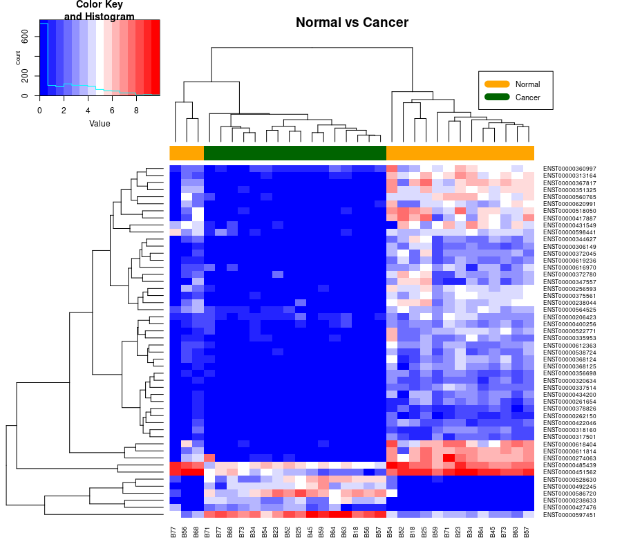

## **3. RNA**


### 3.1. Kallisto

In this step all FASTQC files from patients in the study were alligned against the reference human transcriptome. The objective here is to obtain a .bam file from each alligment. Here the code used for kallisto alligment is shown: 

```{r, eval = FALSE, echo=TRUE, message=FALSE, warning=FALSE}

#!/bin/bash

#SBATCH --job-name=Kallisto
#SBATCH --account=biomedicine
#SBATCH --partition=biomedicine
#SBATCH --cpus-per-task=1
#SBATCH -N 1 # On one node
#SBATCH --mem=4G
#SBATCH --time=0-23:0:0
##SBATCH --mail-type=END
##SBATCH --mail-user=a905162@alumni.unav.es
#SBATCH -o /scratch/a905162/ngs/logs/kallisto%a.log

source /scratch/arubio/bin/moduleloadNGS

FILES=($(cd /scratch/arubio/RNAseq/ && basename --suffix=_1.fastq.gz -- *_1.fastq.gz))

filename=${FILES[$SLURM_ARRAY_TASK_ID]}
mkdir /scratch/a905162/ngs/KallistoMaps/${filename}

chmod 770 /scratch/a905162/ngs/KallistoMaps/${filename}

kallisto quant -i /scratch/arubio/GenomicFiles/kallisto_Assignment_index.idx -o /scratch/a905162/ngs/KallistoMaps/$filename -b 25 -t $SLURM_CPUS_PER_TASK -g /
```

This code was run in ATLAS PC in order to paralelize the job, at first 1 node and 16G of RAM were used but the job efficiency was 23.12%. In order to have a better usage of ATLAS resources, the job was sent again but only using 4G of RAM memory. Finally the efficiency reached has been represented in Figure 11.  


### 3.2. Procesamiento de datos RNA-Seq

To process the RNA-Seq data, to begin with, the required libraries had to be loaded.

```{r, eval=FALSE, echo=TRUE, message = FALSE, warning=FALSE}
library(readr)
library(sleuth)
library(biomaRt)
library(clusterProfiler)
library(org.Hs.eg.db)
library(ggplot2)
library(gplots)
library(ggrepel)
library(EnsDb.Hsapiens.v79)
```

The sample data was downloaded from ADI, and it was also necessary to change the names of the columns in order to correctly identify each of the variables. Furthermore, it was also important to split the column called *sample_name* into two different variables: *sample_ID* (IDs of the subjects) and *sample_type* (Normal or Cancer). 

```{r, eval=FALSE, echo=TRUE, message = FALSE, warning=FALSE}
samples <- read_csv("samples_finalwork.csv",col_names = FALSE)
samples <- read_csv("/Users/gracielauria/Desktop/NGS/final_work/samples.csv",col_names = FALSE) 

# View(samples)

colnames(samples) <- c("ID", "library_strategy", "base_pair_fragment", "Bioproject", "Biosample", "Accession", "X7", "library_selection", "library_source", "library_name", "end_date", "X12", "X13", "Run", "SRS", "SRA_study", "sample_name", "read_length", "center_name", "data_type", "sra", "ncbi", "library_instrument", "library_layout", "organism", "seq_type", "Published")

#This allows to separate from sample_name: B28_normal, the sample_ID=B28 and sample_type=normal
samples$sample_ID <- sapply(strsplit(samples$sample_name, "\\.|_"), function(X) X[1]) #selects part before the underscore 
samples$sample_type <- sapply(strsplit(samples$sample_name, "\\.|_"), function(X) X[2]) #selects part after the underscore 
```


Finally, in order to relate the different transcripts with their corresponding genes, the following chunk of code shows the information that has been downloaded from *Ensembl* [@cunningham2022ensembl]. From all the atributes found in the mart we have extracted in the variable "GeneTranscriptLocation" the gene ID, the transcript ID, the chromosome name, and both the start and end of the transcript. However, we will only use the first two variables, this data frame is composed of 258710 rows, which are all the transcripts available for this ensemble archive version. Later this dataframe will be used to look into the chracteristics of the transcripts that we are studying in this work.

```{r, eval=FALSE, echo=TRUE, message = FALSE, warning=FALSE}
# Annotation: Get all the transcripts, genes, go_id and domains

mart <- biomaRt::useMart(host = 'may2021.archive.ensembl.org',
                         biomart = "ensembl",
                         dataset =   "hsapiens_gene_ensembl") 

#3164 attributes for each of the 258710 reported transcripts in the mart data frame, for example: cds coordinates, 5'UTR start, %GC content
Atributos <- listAttributes(mart) 

#extract the desired attrubtes from mart
GeneTranscriptLocation <- getBM(attributes=c("ensembl_gene_id","ensembl_transcript_id","chromosome_name","transcript_start","transcript_end"),mart=mart)
```


### 3.3. Load and process the data generated with Kallisto

Having obtained the output from Kallisto (the abundance.tsv, abundance.5 and .json for each sample), we have used the abundance.tsv files to make a data frame containing the TPM values of each transcript per sample.
The *RNAseq2* data frame has 199,169 transcripts.

```{r, eval=FALSE, echo=TRUE, message=FALSE, warning=FALSE}
#base_dir = directory where the output of kallisto is stored
base_dir <- "/home/osboxes/Desktop/NGSFolder/FinalWork_NGS_HPC/FinalWork_NGS_HPC/samples" 
base_dir <- "/Users/gracielauria/Desktop/NGS/final_work/samples"
sample_id <- dir(base_dir) #sample_id = the names of the folders.

dirsample<-(paste0(base_dir,"/",sample_id[1]))
dirtoload <- paste0(dirsample,"/","abundance.tsv")
RNASeq <- read.delim(dirtoload,sep = "\t", colClasses = c(NA,"NULL","NULL","NULL",NA))
for (n in 2:length(sample_id)){
  dirsample<-(paste0(base_dir,"/",sample_id[n]))
  dirtoload <- paste0(dirsample,"/","abundance.tsv")
  RNASeq[,n+1] <- read.delim(dirtoload,sep = '\t', colClasses = c('NULL','NULL','NULL','NULL',NA))
}

rownames(RNASeq) <- sapply(strsplit(as.character(RNASeq[,1]),"\\|"),function(X) return(X[1]))
RNASeq<-RNASeq[,-1]
RNASeq2<-as.matrix(RNASeq)
colnames(RNASeq2)<-sample_id
```


### 3.4. Design and contrast matrices

Next, both the design and contrast matrices that have been built will be explained. The variable that will be studied is the sample type, that is, the difference in gene expression between normal and malignant samples. The normal samples will be taken as reference.

```{r, eval=FALSE, echo=TRUE, message = FALSE, warning=FALSE}
# The design matrix is built

model_matrix <- model.matrix(~ sample_ID + sample_type, data = samples)
```

As we will study the *sample type* variable, we just need to build a contrast matrix for this one. Additionally, we need to define the betas and the null hypothesis. First of all, let’s establish the other variables in the design matrix. From the second column to the sixteenth one represent the different patients, since the study is paired. The last column refers to the variable that we want to study, that is, the sample type. Now, we can define the null hypothesis and build the contrast matrix.


We define $\beta_0$ as the mean expression of the transcripts in the normal sample of patient B18. Then, $\beta_0 + \beta_1$ is the mean expression of the normal sample of patient B23, and so on and so forth until $\beta_0 + \beta_{15}$, which is the mean isoform expression of the normal sample of patient B77. However, we are not interested in studying the differences in gene expression among different patients. In fact, as the contrast that we want to make is related to the difference between normal and malignant samples, the null hypothesis is that there is not a significant difference between those two, so $\beta_{16}}$ needs to be equal to 0.

```{r, eval=FALSE, echo=TRUE, message = FALSE, warning=FALSE}
# we create the contrast matrix

cont.matrix <- c(rep(0, ncol(model_matrix)-1), 1)
```

(hacer una tabla en power point)

### 3.5. Sleuth

After having run kallisto for each of the samples, a differential expression analysis will be carried out using sleuth. Sleuth is an RNA-Seq analysis program for which kallisto has been used to quatify transcript abundances [@bray2016near]. First of all, we need to create a tab delimited metadata file for the experiment so we have the factors for each sample ID (header "sample"), the ID of the patients (header "sample_ID"), the type of the sample, that is, whether the sample is normal or malignant (header "sample_type"), and the file path (header "path") to the kallisto output for each sample.

```{r, eval=FALSE, echo=TRUE, message = FALSE, warning=FALSE}
#Keep only the RNA samples from the samples ADI file 
samples_red <- samples[which(samples$Run %in% sample_id),]
samples_red <- samples_red[match(sample_id, samples_red$Run),]

#With the next line we obtain the complete path to each sample folder containing kallisto output
kal_dirs <- sapply(sample_id, function(id) file.path(base_dir,id))

#Build a data.frame with the sample ID, patient ID, condition (normal/cancer) and the kallisto directories for each sample. 
s2c <- data.frame(sample = sample_id,
                  sample_ID = samples_red$sample_ID,
                  sample_type = samples_red$sample_type)

#check that it is ordered
if (!identical(as.vector(s2c$sample),names(kal_dirs))){
  iix <- match(s2c$sample,names(kal_dirs))
  kal_dirs<-kal_dirs[iix]
}
s2c <- dplyr::select(s2c, sample = sample, sample_ID = sample_ID, sample_type = sample_type)
s2c <- dplyr::mutate(s2c, path = kal_dirs)

#Assign the condition value to the intercept
s2c$sample_type <- relevel(as.factor(s2c$sample_type), "Normal") 

s2c_ordered <- s2c[with(s2c, order(sample_type)),]
```

Then, we follow a series of steps in order to obtain the final table. For that, we first load the kallisto processed data into the object using the *sleuth_prep* function. Afterwards we estimate parameters for both the full and reduced sleuth model and we finally perform the differential analysis using the likelihood ratio test (LRT). However, as this method does not report the fold change, we also need to run the Wald test (WT), even though the former test is considered a better one. For most of the analyses and plots that will be carried out in this project the output corresponding to the LRT test will be used, employing the table generated with the WT test just to visualize the volcano plots.

```{r, eval = FALSE, echo=TRUE, message=FALSE, warning=FALSE}
# Load the kallisto processed data into the object
s1 <- sleuth_prep(s2c_ordered, extra_bootstrap_summary=T) 

# Estimate parameters for the sleuth response error measurement (full) model
so <- sleuth_fit(s1, ~ sample_ID + sample_type, fit_name =  'full')

# Estimate parameters for the sleuth reduced model
so <- sleuth_fit(so, ~ sample_ID, fit_name = 'reduced')

# Perform differential analysis (testing) using LRT
so <- sleuth_lrt(so,'reduced', 'full')

# Statistical Analysis result from the “sleuth object”: 
sleuth_table_lrt <- sleuth_results(so, 'reduced:full', 'lrt', show_all = FALSE) ##64681 transcripts
sleuth_significant_lrt <- dplyr::filter(sleuth_table_lrt, qval <= 0.001) #filter by qval
#the qvalue has been lowered from 0.05 to 0.001 because with 0.05 there were 45000 significant transcripts, 
#finally with qval<=0.001 , 8198 transcripts  were kept.

# We also perform the WT analysis 
so <- sleuth_wt(so, paste0('sample_typeCancer'))
sleuth_table_wt <- sleuth_results(so, paste0('sample_typeCancer'))

```

```{r, eval=FALSE, echo=FALSE, message=FALSE, warning=FALSE}
sleuth_table_lrt<-load ("~/Desktop/TrabajoNGS-HPC/sleuth_table_lrt.RData")
sleuth_significant_lrt<-load ("~/Desktop/TrabajoNGS-HPC/sleuth_significant_lrt.RData")
sleuth_table_wt<-load ("~/Desktop/TrabajoNGS-HPC/sleuth_table_wt.RData")
```


### 3.6. Gene Ontology

The enrichGO function of the ClusterProfiler R package was used to perform the Gene Ontology (GO) enrichment analysis for biological processes [cite], before this an extraction of the significant genes from our significant transcripts was performed. 

```{r, eval=FALSE, echo=TRUE, message = FALSE, warning=FALSE}
#Remove the .(number) from the transcript id
sig_transcripts <- sapply(strsplit(sleuth_significant_lrt$target_id,"\\."),function(X) return(X[1]))

#Look what rows of the GeneTranscriptLocation have information of our significant trnascripts
iij <- which(GeneTranscriptLocation$ensembl_transcript_id %in% sig_transcripts)

#Extract the genes corresponding to our transcripts
sig_genes <- GeneTranscriptLocation$ensembl_gene_id[iij] #8031 significant genes 

#Extract all the genes (universe) from GeneTranscriptLocation: 67,128 genes from the 258710 transcripts
universe <- unique(GeneTranscriptLocation$ensembl_gene_id)
```

Then gene ontology was performed with the *enrichGO* function. [OJO] -> The genes related to the gene transcripts with FDR < 0.01 were selected, that is, from the 8031 significant genes that we obtained we keep 4656 genes. The gene universe consisted of the 67,128 genes that were identified in *Ensembl*. So finally in database_enrichGO we obtained the GO terms that are related to the genes that significantly predict the difference in gene expression between normal and cancer samples.

```{r, eval=FALSE, echo=TRUE, message = FALSE, warning=FALSE}
enrichGO <- clusterProfiler::enrichGO(gene = sig_genes, OrgDb = "org.Hs.eg.db",
                                          keyType ='ENSEMBL',  ont ='BP', pvalueCutoff = 0.01,
                                          pAdjustMethod = 'fdr', universe = universe,
                                          qvalueCutoff = 0.05, minGSSize = 5, maxGSSize = 600,
                                          readable ='FALSE', pool = 'FALSE')	

database_enrichgo <- data.frame(enrichGO) #enrichGO@result
```


Moreover, in all the cases, we selected the GO terms with FDR < 0.05 and, among them, we used a cut-off value of 0.7 to reduce redundant GO terms, which means that out of the terms that have a similarity higher than 0.7 (redundant terms), only one of them will be selected (representative term). 

```{r, eval=FALSE, echo=TRUE, message = FALSE, warning=FALSE}

enrichGO@result <- enrichGO@result[which(enrichGO@result$p.adjust < 0.05),]

# We use simplify to remove redundant GO terms (those that are more than 70% similar)
enrichGO_simplified <- simplify(enrichGO, cutoff=0.7, by="p.adjust", select_fun=min)

database_enrichGO_simplified <- data.frame(enrichGO_simplified)
```


Based on the FDR value, the top 20 GO terms were selected as the most enriched processes, which are now represented in a dotplot.
In the gene ratio the % of the genes that have a specific function can be seen, moreover the count represents the nu,ber of reported genes for that function and the gene ration is the count/universe_genes.


```{r, eval=FALSE, echo=TRUE, message=FALSE, warning=FALSE}
# Dotplot
dotplot_enrichGO_simplified <- enrichplot::dotplot(enrichGO_simplified, showCategory = 20) + ggtitle("Dotplot")
```


```{r, eval=FALSE, echo=FALSE, message=FALSE, warning=FALSE}
 #Enrichment Maps (estos mapas los borraba)

#library(enrichplot)
#library(ggnewscale)
#x2 <- pairwise_termsim(enrichGO_simplified)
#emapplot_enrichGO_simplified <- emapplot(x2) + theme(plot.title = element_text(hjust = 0.5)) + ggtitle("Enrichment Map")
#emapplot_enrichGO_simplified


# Other plots

#cnetplot(enrichGO_simplified)
```

As our project is based on a scientific article that was published in 2013, we decided to compare some of the genes that were obtained in our analysis with the ones reported by the researchers. We were most interested in seeing if the genes related to the chromosome seggregation that the paper mentioned (*STAG2* and *ESPL1*), were actually found in the list of genes related to that function (GO:0007059) that we obtained in the enrichment analysis.
As a result, we could see that both of them were included in our results, which is completely logical.

```{r, eval=FALSE, echo=TRUE, message=FALSE, warning=FALSE}
#change the ENSEMBL ID of the significant genes to the SYMBOL GENE ID in order to match the names with the ones that appear on the paper. 
sig_genes_symbol_ens <- ensembldb::select(EnsDb.Hsapiens.v79, keys = sig_genes, keytype = "GENEID", columns = c("SYMBOL","GENEID"))
sig_genes_symbol <- sig_genes_symbol_ens[,1]

genes_paper_RNA <- c("STAG2","ESPL1","FGFR3","TACC3") #genes that appear in the abstract. STAG2 and ESPL1 are the interesting ones (related with sister chromatid cohesion and segregation )
```

We searched manually for the chromosome seggregation function in the *enrichGOsimplified* database.


```{r, eval=FALSE, echo=TRUE, message=FALSE, warning=FALSE}

#Now we need to compare the genes found in the paper with the genes related to chromosome seggregation: database_enrichGO_simp_genes["GO:0007059",]

database_enrichGO_simp_genes <- data.frame(database_enrichGO_simplified$geneID)
rownames(database_enrichGO_simp_genes) <- rownames(database_enrichGO_simplified)

genes_go_chrom_seg <- strsplit(database_enrichGO_simp_genes["GO:0007059",],"\\/")[[1]]
genes_go_chrom_seg_symbol_ens <- ensembldb::select(EnsDb.Hsapiens.v79, keys = genes_go_chrom_seg, keytype = "GENEID", columns = c("SYMBOL","GENEID"))
```


```{r, eval=FALSE, echo=TRUE, message=FALSE, warning=FALSE}

genes_go_chrom_seg_symbol <- genes_go_chrom_seg_symbol_ens[,1] #only GENE IDs
table(genes_paper_RNA %in% genes_go_chrom_seg_symbol) #1 FALSE, 3 TRUE

#Therefore three of the four genes stated in the paper were found
which(genes_paper_RNA %in% genes_go_chrom_seg_symbol) #STAG2, ESPL1 y TACC3 (not FGFR3)

```

Now we are also going to check other genes.

```{r, eval=FALSE, echo=TRUE, message=FALSE, warning=FALSE}

#For variant calling there must be mutations in the genes that are known to be mutated in bladder cancer: TP53, HRAS, FGFR3, PIK3CA, RB1, KARS, TSC1
genes_conocidos <- c("TP53", "HRAS", "FGFR3", "PIK3CA", "RB1", "KRAS", "TSC1") 

#For variant calling there must be mutations in the novel discovered genes: UTX, MLL-MLL3, CREBBP-EP300, NCOR1,ARID1A, CHD6 
chrom_rem_genes <- c("UTX", "ARID1A", "MLL-MLL3", "CREBBP-EP300", "NCOR1", "CHD6")

#The genes found in our sig_genes list (no pasa nada porque no salgan todos porque estamos trbajando con los samples de RNA y no de ADN)
which(genes_conocidos %in% sig_genes_symbol) #KRAS y HRAS
which(chrom_rem_genes %in% sig_genes_symbol) #NCOR1
```

*La parte de IGV*

We were expecting to find also the FGFR3 gene (from the RNA genes list), but we realized that the researchers from the scientific article analyzed the gene fusions, which is not related to the differential expression analysis that has been carried out. For this reason, another approach has been taken. 
We have used the following chunk of code to download the .bam and .bai files of the cancer sample number SRR645259 from subject B59. With these files, we have opened them in the IGV software. As we were expecting to find a gene fusion, we were expecting to find each of the mates from genes FGFR3 and TACC3.
However, as can be seen in the image below, it cannot be seen what had initially been expected. For this reason, it has been decided to process the raw data of the corresponding sample using a different method.

```{r, eval=FALSE, echo=TRUE, message = FALSE, warning=FALSE}
scp a905208@atlas-fdr.sw.ehu.es:/scratch/arubio/DNAseq/resultsBWA/noduplicatesbam/SRR645259_aligned.bam* E:/NGSFolder/FinalWork_NGS_HPC/FinalWork_NGS_HPC/IGV_sample
```


*La parte de STAR*

First of all, the following .sh file has been created in order to get the required index.

```{r, eval=FALSE, echo=TRUE, message = FALSE, warning=FALSE}
#!/bin/bash

#SBATCH --account=biomedicine
#SBATCH --partition=biomedicine
#SBATCH --cpus-per-task=1
#SBATCH --nodes=1
#SBATCH --mem=1G
#SBATCH --time=01:00:00

cd /scratch/arubio/bin

. moduleloadNGS


cd /scratch/a905208/FinalWork/STAR/index

STAR --runThreadN 20 --runMode genomeGenerate --genomeDir /scratch/a905208/FinalWork/STAR/index --genomeFastaFiles /scratch/a905208/FinalWork/Homo_sapiens.GRCh38.dna.primary_assembly.fa --sjdbGTFfile /scratch/a905208/FinalWork/Homo_sapiens.GRCh38.106.gtf --sjdbOverhang 89
```

For this, it has been necessary to download the *Homo_sapiens.GRCh38.106.gtf.gz* file from *Ensembl*, since the one that was already available (*gencode.v24.annotation.sorted.gtf*) was not compatible with the FASTA file.

```{r, eval=FALSE, echo=TRUE, message = FALSE, warning=FALSE}
wget ftp://ftp.ensembl.org/pub/release-106/gtf/homo_sapiens/Homo_sapiens.GRCh38.106.gtf.gz
```

Once finished, the following two files (S1_R1.fq and S1_R2.fq) has been created.

```{r, eval=FALSE, echo=TRUE, message = FALSE, warning=FALSE}
cat SRR645259_1.fastq | head -n 1000000 > S1_R1.fq
cat SRR645259_2.fastq | head -n 1000000 > S1_R2.fq
```

Then, the following chunk of code has been executed from the command line. 

```{r, eval=FALSE, echo=TRUE, message = FALSE, warning=FALSE}
STAR --runThreadN 3 --genomeDir /scratch/a905208/FinalWork/STAR/index --readFilesIn S1_R1.fq S1_R2.fq --outFileNamePrefix S1_test --outSAMtype BAM SortedByCoordinate --outSAMunmapped Within --outSAMattributes NH HI AS NM MD
```

Finally, to generate the .bai file from the .bam file that has been generated in the previous step, the following code has been run.

```{r, eval=FALSE, echo=TRUE, message = FALSE, warning=FALSE}
samtools index S1_testAligned.sortedByCoord.out.bam
```

Figure 23.** output STAR en IGV.]
Figure 24.** seff STAR.]

### 3.7. PCA

To separate all the samples in clusters based on the results of differential gene expression analysis we first performed a PCA selecting the 8198 differentially expressed transcripts (FDR < 0.001). The correct separation between the sample groups confirms that the selected transcripts could be considered adequate to stratify the samples in the two groups. Moreover, the axes are ranked in order of importance, where differences along the first principal component axis (PC1) are more important than differences along with the second principal analysis (PC2).

```{r, eval=FALSE, echo=TRUE, message = FALSE, warning=FALSE}

#Remove .(number) from the transcript ID.
rownames(RNASeq2) <- sapply(strsplit(rownames(RNASeq2), "\\."), function(X) X[1])

#Keep only the significant trnanscripts in the trnanscrips vs samples data frame 
RNASeq2_filtered <- RNASeq2[sig_transcripts,] #keep 8,198 transcripts of the original 199,169

#Order the column of "sample number"(SRR) from the sc2 data frame in ascending order according to the sample number
col.order <- s2c_ordered$sample 

#order the col names (sample numbers) of RNASeq2_filt_ord in ascending order
RNASeq2_filt_ord <- RNASeq2_filtered[, col.order] 

PCs <- prcomp(t(log2(1+RNASeq2_filt_ord)), center = T, retx = T)

data_PCA <- data.frame(samples = rownames(PCs$x),
                       ID = s2c_ordered$sample_ID,
                       type = s2c_ordered$sample_type,
                       PC1 = PCs$x[,1],
                       PC2 = PCs$x[,2])
```


```{r, eval=FALSE, echo=FALSE, message=FALSE, warning=FALSE}
Fig_PCA <- ggplot(data_PCA) + geom_point(aes(x=PC1, y=PC2, color = type, size = 4)) + geom_label_repel(aes(x=PC1, y=PC2, label=ID)) +
  xlab('PC1') + ylab ('PC2') +
  theme_classic() + theme(legend.title = element_blank())
Fig_PCA
```


### 3.8. Heatmap

In order to visualize more clearly the expression pattern of the most significant transcripts, a heatmap has been plotted. In addition to showing both the sample and transcript IDs in the columns and rows respectively, they have been distributed using a hierarchical clustering algorithm, so that the samples or transcripts that show a more similar behavior are closer to each other. Additionally, it has been decided to plot just the 50 most significant transcripts in order to better appreciate the difference in expression pattern between the studied groups.

```{r, eval=FALSE, echo=TRUE, message=FALSE, warning=FALSE}

RNASeq2_filt_ord <- RNASeq2_filtered[, col.order]
colnames(RNASeq2_filt_ord) <- s2c_ordered$sample_ID

num_cancer <- length(which(s2c_ordered$sample_type=="Cancer"))
num_normal <- length(which(s2c_ordered$sample_type=="Normal"))


heatmap_plot <- heatmap.2(x = log2(1+RNASeq2_filt_ord[1:50,]),
                       col="bluered",
                       trace="none",
                       ColSideColors = c(rep("orange", num_normal), rep("dark green", num_cancer)),
                       main="Normal vs Cancer",
                       margins = c(4,10)
)
legend(0.8,1.1, legend = c("Normal", "Cancer"),col = c("orange", "dark green"), lty= 1, lwd = 10, cex = 0.7)
```



### 3.9. Boxplot

Next, we represent the gene expression values measured in TPMs of the most significant transcripts. To select the 10 most significant transcripts, those with a lower FDR value were chosen.

```{r, eval = FALSE, echo=TRUE, message=FALSE, warning=FALSE}
#separate the 10 most significant transcripts and separate the ENST32(...) from the .number 
sig_transcripts_sample <- data.frame(
  tran_name_1 = sapply(strsplit(sleuth_significant_lrt$target_id[1:10],"\\."),function(X) return(X[1])),
  tran_name_2 = sapply(strsplit(sleuth_significant_lrt$target_id[1:10],"\\."),function(X) return(X[2]))
  )

#find which are the rows in GeneTranscriptLocation that coincide with our 10 most significant transcripts
iij_sample <- which(GeneTranscriptLocation$ensembl_transcript_id %in% sig_transcripts_sample$tran_name_1)

#obtain the gene IDs corresponding to those 10 transcripts
sig_genes_sample <- GeneTranscriptLocation$ensembl_gene_id[iij_sample]

#put together Genes and transcripts
sig_trans_genes_sample <- GeneTranscriptLocation[iij_sample, c(1,2)]

colnames(sig_transcripts_sample)[1] <- "ensembl_transcript_id"

#put together:  transcripts_ID, .(number), gene ID
sig_df <- merge(sig_transcripts_sample, sig_trans_genes_sample, by = c("ensembl_transcript_id"))

#obtain the gene symbols for the gene IDs and add it to sig_df
sig_genes_symbol_ens_sample <- ensembldb::select(EnsDb.Hsapiens.v79, keys = sig_genes_sample, keytype = "GENEID", columns = c("SYMBOL","GENEID"))
colnames(sig_genes_symbol_ens_sample)[2] <- colnames(sig_df)[3]
sig_df <- merge(sig_df, sig_genes_symbol_ens_sample, by = c("ensembl_gene_id"))
sig_df$SYMBOL_transcript_id <- paste0(sig_df$SYMBOL, "_", sig_df$tran_name_2)
```


```{r, eval = FALSE, echo=TRUE, message=FALSE, warning=FALSE}
RNASeq2_filt_ord_sample <- log2(1+RNASeq2_filt_ord[sig_transcripts_sample$ensembl_transcript_id,])

sig_df_bp <- sig_df[match(sig_transcripts_sample$ensembl_transcript_id, sig_df$ensembl_transcript_id),]

data_boxplot <- data.frame(transcripts = rep(sig_df_bp$SYMBOL_transcript_id, length(col.order)), sample_id = rep(col.order, each=length(sig_df_bp$SYMBOL_transcript_id)), sample_type = gl(2,length(sig_df_bp$SYMBOL_transcript_id)*num_normal,labels = c('Normal','Tumor')), values = as.vector(RNASeq2_filt_ord_sample))
data_boxplot$transcripts = as.factor(data_boxplot$transcripts)
```


```{r, eval=FALSE, echo=FALSE, message=FALSE, warning=FALSE}
Fig_boxplot <- ggplot(data = data_boxplot, aes(x = transcripts, y = values, fill = sample_type)) +
  geom_boxplot(width=0.5,position=position_dodge(width=0.5),outlier.shape = NA) +
  coord_cartesian(ylim =c(0,10))+ theme_classic() +
  stat_boxplot(geom="errorbar",position = position_dodge(width=0.5),width=0.2)+
  theme(plot.title = element_text(hjust = 0.5,margin=margin(0,0,10,0), size = 11),
        axis.text.x = element_text(hjust=0.9,vjust=0.9,angle=45),
        axis.text.y = element_text(margin=margin(0,0,0,10)),
        axis.title.x=element_blank(),
        axis.title.y = element_blank(),
        panel.grid.major = element_blank(),
        panel.grid.minor = element_blank(),
        panel.background = element_rect(colour = "black", size = 1),
        axis.ticks.x = element_blank(),
        legend.title = element_blank()) +
  ggtitle('Differential gene expression of the 10 most significant transcripts ')
Fig_boxplot
```


### 3.10. Volcano plot

Differential expression analysis revealed that between the normal and malignant groups of patients, there are 879 transcripts altered with an FDR < 0.01 and a beta > |3|. Moreover, 141 of them belong to the overexpressed group (beta > 3) whereas 738 of the isoforms are underexpressed (beta < -3). The labelled transcripts are the ones whose expression was plotted through a boxplot in the previous image. 

```{r, eval = FALSE, echo=TRUE, message=FALSE, warning=FALSE}
transcripts <- sapply(strsplit(sleuth_table_wt$target_id,"\\."),function(X) return(X[1]))
p_adjust <- sleuth_table_wt$qval
beta <- sleuth_table_wt$b

volcano_df <- data.frame(transcripts = transcripts,
                         pvalue = -log10(p_adjust),
                         beta = beta)

volcano_df$sig <- factor(rep(0,nrow(volcano_df)), levels = c(-1,0,1))
volcano_df$sig[p_adjust < 0.01 & beta < -3] <- -1
volcano_df$sig[p_adjust < 0.01 & beta > 3] <- 1
volcano_df$lab <- ''

iix <- which(volcano_df$transcripts %in% sig_df$ensembl_transcript_id)
sig_df_ord <- sig_df[match(volcano_df$transcripts[iix], sig_df$ensembl_transcript_id),]

volcano_df$lab[iix] <- sig_df_ord$SYMBOL_transcript_id


Fig_volcano <- ggplot(data = volcano_df) + geom_point(aes(x = beta,
                                                          y = pvalue,
                                                          colour = sig),
                                                      size = 1) + 
  theme_classic() + scale_x_continuous(limits = c((-max(abs(beta)) - 0.5),
                                                  (max(abs(beta)) + 0.5))) +
  scale_color_manual(values = c("#2600D1FF","#000000","#D60C00FF"), drop = F) +
  theme(plot.title = element_text(hjust = 0.5),
        panel.grid.major = element_blank(), panel.grid.minor = element_blank(),
        panel.background = element_rect(colour = 'black', size = 1),
        legend.position = 'none') + ggtitle("Volcano  plot") + 
  xlab("Beta") + ylab(bquote(~-Log[10]~Adjusted~p-Value)) +
  geom_hline(yintercept = -log10(0.01), linetype = 'dashed') +
  geom_vline(xintercept = -3, linetype = 'dashed') +
  geom_vline(xintercept = 3, linetype = 'dashed') +
  geom_label_repel(aes(x = beta, y = pvalue, label = ifelse(lab != '', lab, '')))
Fig_volcano
```


## **4. CONCLUSIONS**   


## **5. BIBLIOGRAPHY**  


